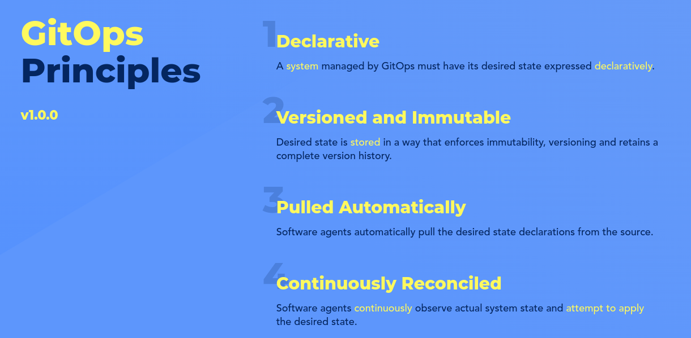

# Introduction to GitOps

GitOps is a way of implementing Continuous Deployment for cloud native applications. In fact GitOps does not merely acheive Continuous Deployment, It does more than that. 

Continuous Deployment (CD) is not GitOps. To be true GitOps the following principles as defined by OpenGitOps must be followed.

- Declarative - A system managed by GitOps must have its desired state expressed declaratively.
- Versioned and Immutable - Desired state is stored in a way that enforces immutability, versioning and retains a complete version history.
- Pulled Automatically - Software agents automatically pull the desired state declarations from the source.
- Continuously Reconciled - Software agents continuously observe actual system state and attempt to apply the desired state.

GitOps is a way of managing our applications and even infrastructure, so that whole system is described declaratively and version controlled mostly in a Git repository, and having an automated process that ensures that the deployed environment matches the state specified in a repository.

Most CI tools typically take a push approach and lack any form of feedback. Whereas, GitOPs follows a Pull model. The concept is to install a GitOps agent on our cluster, that will be constnatly watching our source repository where all our application code resides. This agent, when sees a drift in our source repo and the deployed status. It pulls, the latest configuration asd defined in our source. 

Reconciliation refers to ensuring that a given state, that is the code running in our cluster matches the desired state defined in our source git respository (other source can be configured like, BitBucket, GitLab, etc). By keeping the entire state of your environment under source control, a GitOps-based approach makes it easier to make infrastructure changes and adjustments as needed. With Git's revert/rollback capabilities, rolling back to the last known good configuration when you experience problems is straightforward. Since your entire system is defined in Git, you can quickly recover during an incident by rolling back to the previous version.

## Key Benifits of integrating GitOps in our workdlow

- Improved Collaboration: With the entire infrastructure defined in a git repo, teams can push PR's to create incremental improvements to the code. We can configure CI workflows to generate builds for Dev/Staging teams. Who, then can test the application and tests for bugs if any.
- Increased Deployment: As smaller chanes are pushed and tested frequently, it enables to deploy a finished product in a much shorter timeframe. This encourages dev teams from experimenting without the fear of 'what happens if things go wrong?'. As we can recover from the misconfigs with the ability to rapidly and conveniently recover from the disaster.

# resources:
- [GitOps](https://www.gitops.tech/)
- [Guide To GitOps — ](https://www.weave.works/technologies/gitops/)