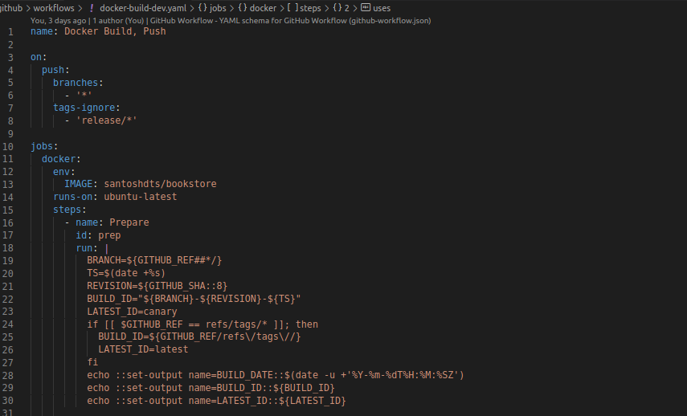
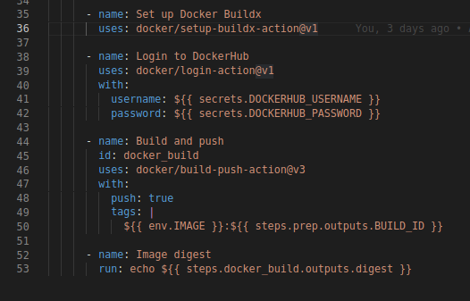
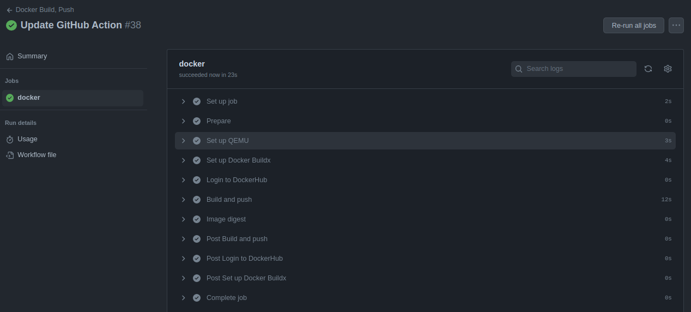
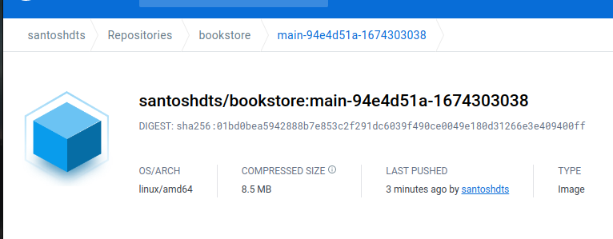
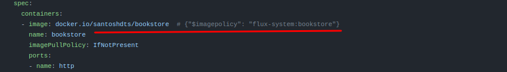
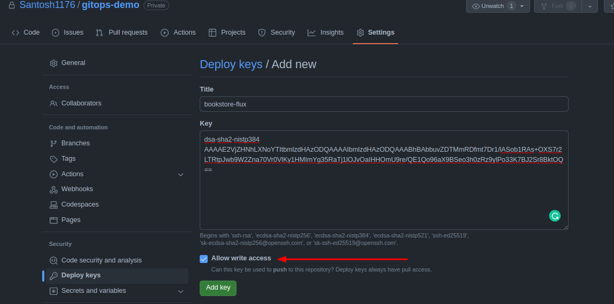

# Continuous Deployment with FluxCD

In this session, I will be working on applying Continuous deployment strategy using [FluxCD](https://fluxcd.io/flux/), a CNCF hosted GitOps tool. I already have a repository of the application hosted on github on which I will be working on.

Our goal in thios exercise would be:
- Build a GitHub Action, similar to the last one. That will push a new versioned image to Docker hub  when a new commit is pushed to the repo.
- Install Flux on the Kubernetes Cluster using the FluxCD's bootstrap command.
- Apply Flux Image Automation tools required to watch for any changes in the Image.
- Configure our Deployment to pull the latest versioned image from the Docker hub.

# Build a Github Action to build a versioned image

This is very similar to the Github Action, we worked on in the [earlier session](../github-actions/35-docker-push.md). We willbe tweaking some of the functionality of ot to produce and push a versioned image to DockerHub.



This action gets triggered wheenever a commit is pushed to **any branch**. The script you see from line 18 to 30 does is collect the *Branch Name*, *Commit SHA*, and the *Timestamp*. This is used for tagging when the *Docker Build and Push* action is triggered. 



It's just that simple. Now, if we push a commit to this repository this action will get triggered and a new image with a tag formatted with `BRANCH-GIT_SHA-TimeStamp`.



The action was run succussfully and a new tagged image was pushed to DockerHub as desired. Let's check the Docker Hub for the new Image with the new tag.



You can see, the image was tageed with `main-94e4d51a-1674303038` as we had configured in the script that ran in our GitHub Action. 

Now, as we are getting a new image with tag correspomding with a timestamp. we can leverege this and use it in our FluxCD configuration.

## Installing FluxCD

Installing Flux becomes very easy task with some help from the [Flux getting started guide](https://fluxcd.io/flux/get-started/). After checking for all prerequisites like having Kubernetes cluster running, installing FluxCLI, and exporting the GitHub credentials. we can use the Flux Bootstrap command to install Flux on our system.

```bash
$ flux bootstrap github \
  --owner=$GITHUB_USER \
  --repository=gitops-demo \
  --branch=main \
  --path=./clusters/my-cluster \
  --personal
  --components-extra=image-automation-controller,image-reflector-controller
  ```
  It will create a gitrepository by name `gitops-demo`, generate manifests and install various FluxCD components in the Flux-system namespace.

  ```bash
  ► connecting to github.com
✔ repository created
✔ repository cloned
✚ generating manifests
✔ components manifests pushed
.
.
.
✔ sync manifests pushed
► applying sync manifests
◎ waiting for cluster sync
✔ bootstrap finished
```
Check for all the Flux components installed:

```bash
$ k get deploy -n flux-system 
NAME                          READY   UP-TO-DATE   AVAILABLE   AGE
helm-controller               1/1     1            1           2d4h
image-automation-controller   1/1     1            1           2d4h
image-reflector-controller    1/1     1            1           2d4h
kustomize-controller          1/1     1            1           2d4h
notification-controller       1/1     1            1           2d4h
source-controller             1/1     1            1           2d4h
santosh@~:$ 
```
Apart from deployments, Flux installs sonfigMaps,Secrets, ClusterRoles, ClusterRoleBindings, etc in the `flux-system` namespace. Once all the components are up and running, we can clone the `gitops-demo` repo and cd into `cluster/my-clusters` dir. Then we can move ahead by adding our application repository to Flux.

generate the yaml config creating a new component in Flux known as `GitRepository`, which points Flux to our apllication repo's main branch:

```yaml
apiVersion: source.toolkit.fluxcd.io/v1beta2
kind: GitRepository
metadata:
  name: bookstore
  namespace: flux-system
spec:
  interval: 30s
  ref:
    branch: main
  #This is our main appliaction repository we want to link with FluxCD
  url: https://github.com/Santosh1176/bookstore-api/
  ```
Commit and push the changes.

Next, we need to build and apply Kustomize configurations from our application repository.

```yaml
apiVersion: kustomize.toolkit.fluxcd.io/v1beta2
kind: Kustomization
metadata:
  name: bookstore
  namespace: flux-system
spec:
  interval: 5m0s
  # A Directory where all application manifests with Kustomization are available
  path: "./kustomize/"
  prune: true
  sourceRef:
    kind: GitRepository
    name: bookstore
```  
I have pointed to a `./kustomize` directory on my [Bookstore application repository](https://github.com/Santosh1176/bookstore-api). commit and push the changes.

Now, we should see our application deployed on our cluster. So far, flux is likend to my Bookstore application repository and has applied Kustomize configs availabe in my repo. Now, we need to configure Flux to watch for any new image build and pull the latest among the tagged images based on the timestamp we've configured earler in GitHub Action.

In order to acheive this, we need to tell Flux which image repository to look for. This we do by adding a `ImageRepository` to our `gitops-demo` repository:

```yaml
apiVersion: image.toolkit.fluxcd.io/v1beta1
kind: ImageRepository
metadata:
  name: bookstore
  namespace: flux-system
spec:
  #This is the registry we want to monitor
  image: docker.io/santoshdts/bookstore
  interval: 1m0s
```

In our case, its a public repository. However, if you have a private registry, it is advised to generate a secret of type `docker-registry` and configure Flux to use it by specifying it in the above manifest by adding:

```yaml
spec:
  secretRef:
    name: <Secret Name>
```
One we have our **Imagerepository** resources created and pushed to the `gitops-demo` repo. Its time to tell Flux which style of versioningto use while filtering for image tags. For this we create a **ImagePolicy** resource in the `gitops-demo` repo with following config:

```yaml
apiVersion: image.toolkit.fluxcd.io/v1beta1
kind: ImagePolicy
metadata: 
  name: bookstore
  namespace: flux-system
spec:
  imageRepositoryRef:
    name: bookstore
  filterTags:
    # The ReGex patter matching our requirement, Tagging an image with <Branch>-<Git-SHA>-<TimeStamp>
    pattern: '^main-[a-fA-F0-9]+-(?P<ts>.*)'
    extract: '$ts'
  policy:
    numerical:
      order: asc
```flux get image policy
We can provide patterns as per our requirements in `spec.filters.pattern` field. [For example](https://fluxcd.io/flux/components/image/imagepolicies/#examples), instead of patterns, we can specify a policy like so:

```yaml
spec:
  imageRepositoryRef:
    name: bookstore
  policy:
    semver:
      range: 1.0.x
```
> But for this, we need to configure our GitHub Action to trigger on a change in git Tag.

Once, the ImagePolicy is pushed to our `github-demo` repo. We can ask Flux to apply the changes locally by reconciling with source:

`flux reconcile kustomization flux-system --with-source`.

Once the reconcile is done, we should see the image tags from our container registry:

```bash
$ flux get image repository bookstore 
NAME     	LAST SCAN                	SUSPENDED	READY	MESSAGE                       
bookstore	2023-01-21T21:29:45+05:30	False    	True 	successful scan, found 4 tags
```

We can also see the tags that match our patter specified in the *ImagePolicy*:
```bash
$ flux get image policy bookstore 
NAME            LATEST IMAGE                                            READY   MESSAGE                                                                                     
bookstore       docker.io/santoshdts/bookstore:main-94e4d51a-1674303038 True    Latest image tag for 'docker.io/santoshdts/bookstore' resolved to: main-94e4d51a-1674303038
```

This is a matching tag we desired `bookstore:main-94e4d51a-1674303038`. Still, we need to tell Flux to which Gitrepository to ipdate the tags. We Do this by adding a **ImageUpdateAutomation** resource, like so:

```yaml
apiVersion: image.toolkit.fluxcd.io/v1beta1
kind: ImageUpdateAutomation
metadata:
  name: flux-system
  namespace: flux-system
spec:
  interval: 1m0s
  sourceRef:
    kind: GitRepository
    name: flux-system
  git:
    checkout:
      ref:
        branch: main
    commit:
      author:
        email: dtshbl@gmail.com
        name: fluxcdbot
      messageTemplate: '{{range .Updated.Images}}{{println .}}{{end}}'
    push:
      branch: main
  update:
    path: ./clusters/my-cluster
    strategy: Setters
```

Ther's a special syntax to tell our deployment manifest to watch for the specific *ImagePolicy*. For this we need to edit the main deploymenmt file in our `bookstore` repositorty. 



The `# {"$imagepolicy": "flux-system:bookstore"}` tag in front of the image file tells the deployment to track a specific *ImagePolicy* reource, here I've configured it to: `flux-system: bookstore` its a combination of `Namespace: ImagePolicy`. More on this patching mechanism is explained [here](https://fluxcd.io/flux/guides/image-update/#configure-image-update-for-custom-resources).


With these resources updated in our `gitops-demo` and `bookstore` repo, our deployment manifest should be updated with the lates image tags based on the `timestamp`. But, we need to provide write access to the `gitops-demo` repository to write to our application repository. This can be acheived by generatinga **deploy key** from our management repositoiry. we can generate the key using the `flux` cli. For this we would require a *Flux Secret* which is available at `.spec.secretRef.name` from our GitRepository resource. And, we can generate the secret by:

```bash
flux create secret git \
--namespace=flux-system \
flux-system \
--url=ssh://git@github.com/Santosh1176/bookstore-api
```
This would generate a public key, which we need to enter into our `gitops-demo` repo. We need to ensure the **Allow write access is check**. 



Once this little place is configured , we can commit to our application code, and witness within minutes the newly build image being pulled from the DockerHub into our deployment namespace.

we can check this:

```bash
$ k get deploy -n frontend-api bookstore-frontend -oyaml | grep -i image
        image: docker.io/santoshdts/bookstore:main-94e4d51a-1674303038
        imagePullPolicy: IfNotPresent
```

You can clearly see the image we have mentioned in our Deployment manifest ash shown above ( image used for tagging with ImagePolicy) is different from the currently deployed one, as I have pushed some minor updates to the application. Hence, the change in the Image Tag.

With this automation for our Dev/Staging teams is complete, we can move in similar fashion to implement a similar workflow for our Prod teams. This would be where, the image tagging would be based on more realistic real world scenarios like using **semVers**, etc. The GitHub Action here would depend on any changes made with Git Tags and/or any PR's merged.


# Resources:
- [Automate image updates to Git](https://fluxcd.io/flux/guides/image-update/)
- [Flux Bootstrap](https://fluxcd.io/flux/get-started/)