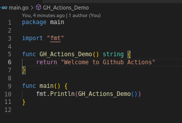
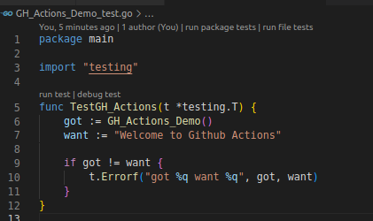
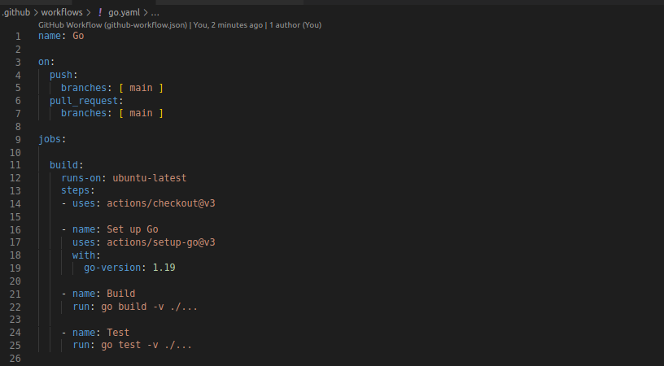
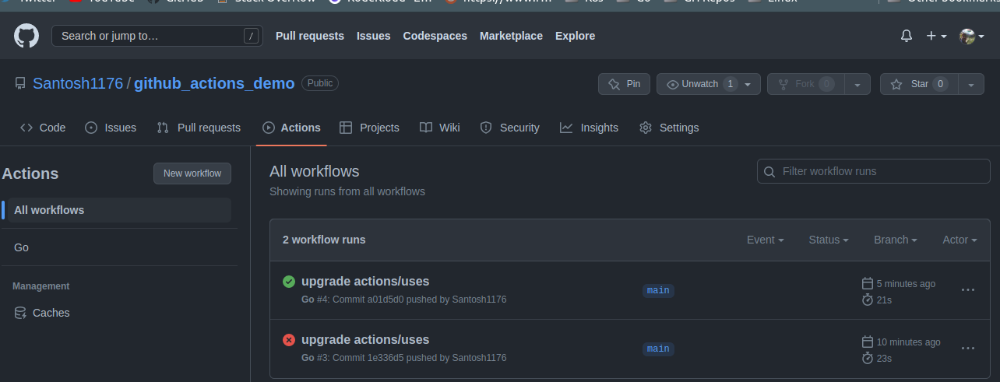
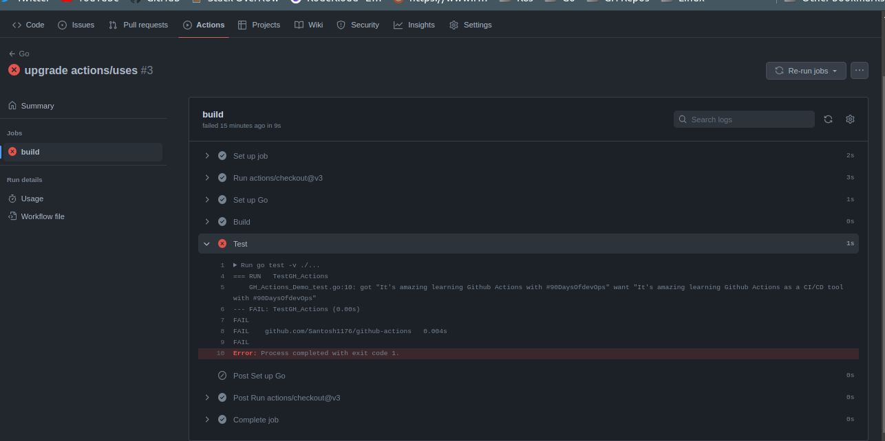

# An Intro to Github Actions

GitHub Actions is a [continuous integration and continuous delivery](../33-ci-cd-intro.md) (CI/CD) platform that allows you to automate your build, test, and deployment pipeline. We can create workflows on some events the occurin our Github repository.

To understand the core concepts in Github Actions, we can break it down into the following components:

- **Workflows**: A workflow is a configurable automated process that will run one or more jobs. Workflows are defined by a YAML file and are stored in `.github/workflows`  directory in the root of the repository. Workflows run when triggered by an *event* in your repository, or they can be triggered manually, or at a defined schedule.

- **Events**: Events in Actions are some activity that happens inside a Github repository. Events trigger some activity on a specific repository. The activity may be in a form of pushing a code, creating a branch, opening a pull request, and even commenting on an issue. Github has maintained an extensive [list of events](https://docs.github.com/en/actions/using-workflows/events-that-trigger-workflows#webhook-events).

- **Jobs**: A job is a set of tasks that gets executed in a workflow upon being triggered by an event. A workflow can have multiple jobs that run in parallel. Each step is either a shell script that will be executed, or an action that will be run. We can build a hirarchy of jobs based on other jobs — We can configure a job's dependencies with other jobs. For example, we may have multiple build jobs for different architectures that have no dependencies, and a packaging job that is dependent on those jobs. The build jobs will run in parallel, and when they have all completed successfully, the packaging job will run.

- **Runners**: Runners are processes on a server that run the workflow when it’s triggered. Each runner can run a single given job at a time. Github provides runners for most the Operating Systems, like Ubuntu Linux, Microsoft Windows, and macOS to run your workflows. For a runner specificlly to run on a different OS, we can host our [own runner](https://docs.github.com/en/actions/hosting-your-own-runners).

- **Actions**: Actions are individual tasks: they are called inside a job. An action run a custom application for the GitHub Actions platform that  can perform a complex but frequently repeated task. We can build our own actions or we can reuse some open-source actions from the Github [marketplace](https://github.com/marketplace?type=actions) and add them to our workflow directly if we find them suitable for our needs.

## Hello World with Github Actions

I have created a [demo repository](https://github.com/Santosh1176/github_actions_demo) with a simple go program which resturns `Welcome to Github Actions` when run:

I've also added a `main_test.go` test file:

### Create a Action workflow

To create a workflow, we create a `.yaml` file in `.github/workflows` in the root of the project, I've named it `go.yaml`. In this file we define our action, that basically uses `Golang`, builds our project and finally runs tests.:

The structure of our action file `go.yaml` is very intuitive — That's how YAML makes it so easy to read. On line eleven to fourteen in the `jobs` section, we define to use the `ubuntu-latest` runner. On line sixteen-ninteen, we define to setup Golang for our jobs. Finally, from twentyone to twentyfive, we build our Go program and run tests on it.

Once we push this code to our repository, and whenever we push some modification to the repository, the Github action will run. As you can see, I've made two commits to this repo and the actions were run each time:

As you can see I have one succusful test and a filure. If we expand on any of the commit messages, we can see the details about the jobs which succeded or failed:

We can see the test job failed and the details are provided.

In this session, we just scratched the surface of Github Actions, as with other chapters, we shall build upon this and learn more about Github actions and other CI/CD tools.
