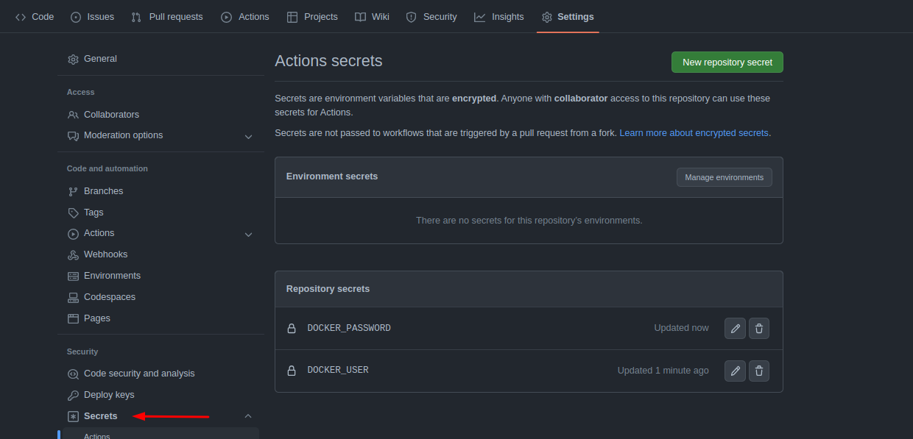
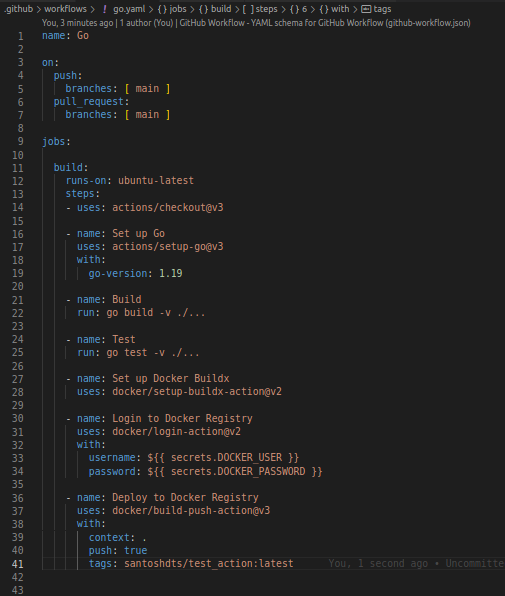

# Moving ahead with Github Actions

In this session, we are going to build up our last Github Action and move ahead with deploying our code to registries. 

We had built a action which builds and tests our code after a new commit is pushed to the repository. To we are going to push the code to **Docker Hub**. Before we move ahead, we need to do some ground work interms of creating some Github secrets required for our action workflow.

To create a Github secret, we need to goo to the settings tab from our repository and select the `secrets` button from the left drop-down list. We willbe presented with **Actions Secrets** window. By clicking on the *New repository secret* button, we can provide a new set of secret that would be used by this reppository. We can give a name and secret and add the secret. I have provided by **DOCKER_USER** and **DOCKER_PASSWORD** as repository secrets. Once we have this out of the way. We can proceed to write the action in our `go.yaml` file.

First we will *use* the **docker/setup-buildx@v2** action, this will used to create and boot a builder that can be able to build multi-platform images and export cache using a BuildKit container. Next we will use the **docker/build-push-action@v3** action to build and push the newly created image to the docker hub registry. For this job, we have to ptovide the docker hub credentials. That we have passed as variables which we had created earlier. we can pass any *repository secret* wnclosed in curly brackets with `secrets` prepended to the secret name.

The full action for push to docker-hub is attached below. Now, once we push any new commits to the repo, the action will trigger the workflow, o test the code, huild the image and push to docker-hub.

I pushed this code to the repo and the action was run and the image was pushed to my docker-hub repository. We can see the the new image with the `latest` tag in my registry.

As, you can see we have provided all the credentials and the repository details in the job named **Login to Docker Registry**. We will also ask this job to append the tag with `latest` while pushing to docker hub.