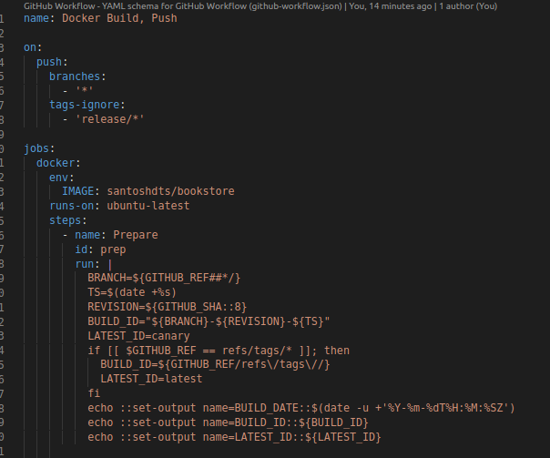
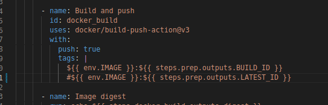
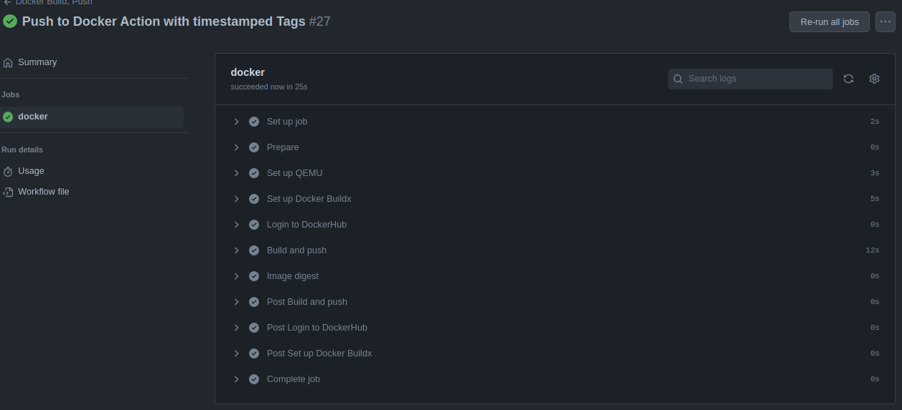
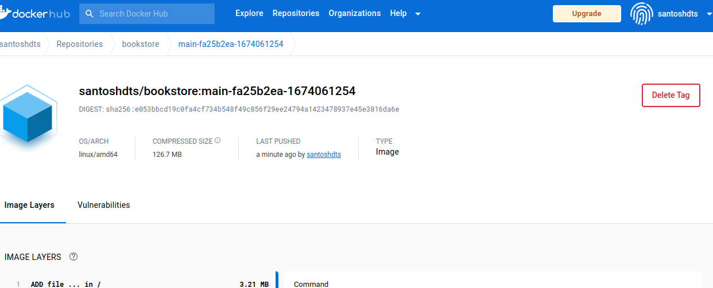

# Decoupling the CI and the CD processes

I the previous session, we worked with Github Actions with a triggering a test of our pushed code and building and pushing an Docker image to Docker HUb. This basic workflow covers the Continuous Integration process our our CI/CD strategy. 

It has been a mater of consistent debate on decoupling the CI and the CD proceses. Some of the reasons for following such practices are: as there is a branch for each environment and we would want any changes in that specif branch, the code is built and deployed in the related environment. This becomes complex if, we maintain both the CI and CD processes saperately.

Ideally what we would like is, Dev build generates a tag from some feature or environment branch with the branch name, commit hash, and timestamp; and a Release build produces a semantic version tag from the release tag that preceded it. This enables each environment to have a separate process that is pulling from the artifact repository and deploying in the specific environment. This also facilitate for the Dev team to fail fast and safely without affecting the crucial production pipeline which is serving endusers. 

# Levereging Github Action for Ci and Fluxcd for CD

To achive this work flow, I shall be working with [**GitOps**](https://www.gitops.tech/#what-is-gitops) methdology. GitOps practices states that each environment should be declared in a manifest, ideally in Git. So it means that the environments are directly inferred from the source control. As we are already having our source code in Git and already have built a CI pipeline to build a artefact. Our next step would be to tweak the CI workflow a bit to achive our desired goal of, initally creating a saperate artifact for Dev and Prod enviornment. And Then use a GitOPs tool, to work on that artifact and deploy the application based on changes in a Tag. The tool I've chosen to work with GitOps is [**FluxCD**](https://fluxcd.io/flux/concepts/). Flux2 provides a seamles workflow to achive my desired objective.

For this workflow of CI with Github Action and CD with Flux2, I will be using one of my projects which is built in Golang and Postgres as Database. Its a simple [Bookstore application](https://github.com/Santosh1176/bookstore-api), which allows users to Add, Update, Fetch and Delete the books to the database.  

First We need to add a Github Action to build an artifact from the code when a new commit is pushed to a specific Git Branch. I've used a similar Github action from preivious sessions, but added a script which runs and only takes some inputs from environment variables set by GitHub Actions and calculates them into several outputs: **BUILD_ID** and **LATEST_ID**. The **BUILD_DATE** is also exported as an output for informational purposes and is not used elsewhere in the workflow. **TS** is the Unix timestamp in seconds, a monotonically increasing value that represents when the build got scheduled. This lets us reliably determine what build is actually latest, even when some builds may take longer or shorter.

Note the the `on.push.branches` field on the top of the action. This tells to watch pushes on any branches, which will trigger some steps to build the artifact and tag it with `brach-git_sha-timestamp`. When in the next sessions, we will builtd a workflow for production pipeline, we shall change it to wtach for any `git tags`.

When this Action runs, i.e when a commit is pushed to any branch of the repository. The Build process will build an image with tag combining the `Git Branch Name`, The First 8 digits of `Github SHA`, and the Unix timestamp in seconds. The whole Tag would look something like: `santoshdts/bookstore:main-fa25b2ea-1674061254` when tis action was run and the artefact pushed to Docker Hub.

As you can see, I have configured to tag the current push with the *Branch*, *Git-SHA*, and *Timestamp*. and for future usecase, have commentd out the usage of `latest` tag. 

Once the commit is pushed on any branch, the artefact is rightly pushed to Docker Hub as shown in Image.

This is a part of the workflow, where the Dev/Staging teams can work on based on a specific tag. And, we can trigger a saperate workflow, if the artifact produced was meant for production team, may be with *semver* tag to the artifact. In later workflows we shall see the advanage Flux provides with versioning our artefacts with timestamped tags instead of a mutable latest tag.

The current artifact could be used by the Dev/Staging teams in their Deployment and work on the source code to add new features, eliminate bugs reported, if any, etc. In this scenerio, the latest image is deployed, based on a timestamp. This is an appropriate config for rapid iteration and might be adapted for production.

Though this action took merely 23 seconds to complete to ptroduca a artifact of 126Mb is bit concerning in a setting where the Deploy pipeline is working faster than the CI workflow and ultimately make the FLUX wait for CI too toi finish the process. This could be mitigated by leveraging Docker's *caching* mechanism. Greater time spent waiting for CI/CD can unfortunately have outsized impacts on focus depletion and developer productivity. The answer to this lies in skillfully designing the *Dockerfile*. Arranging your build order so the slow parts that change less frequently are built first, or in a separate staging, means they can be cached and repeated only as often as they change.

This is an initial step to get versioned images in our registry. In the next session, we will leverage this Github Action and integrate this with GitOps based Continuous Delivery pipline, which will pull thge latest version based on above tag of the image to our application deployed on the Kubernetes cluster. 

# Resources:

- [CI/CD with Github Actions and FluxCd by Kingdon Barret — Github](https://github.com/kingdonb/github-actions-demo)
- [CI/CD with Github Actions and FluxCd by Kingdon Barret — YouTube](https://youtu.be/cR2eCMbiZg4)
- [FluxCd Documents for CICD with Github Action](https://fluxcd.io/flux/use-cases/gh-actions-app-builder/)
