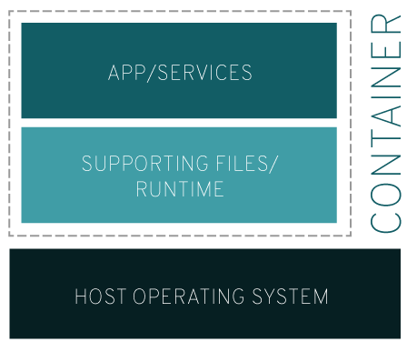
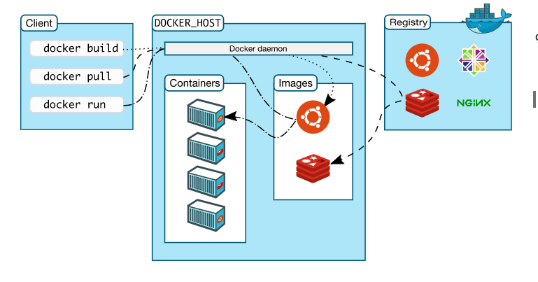

# Introduction to Containers

Containers are a lightweight technology that enables developers to package applications including their dependencies into an isolated environment, enabling them to move the containerized application between different environments, for example: (Dev, Prod, and Test) and different Operating Systems.

Containers are Linux processes that are isolated from the rest of the system. It can be considered as the evolution of Virtualization technology.

**Image from: [redhat.com](https://redhat.com)**

As you can see from the above images, both technologies enable running multiple Operating Systems side by side. But, the Linux Containers technology is much lightweight as compared to the traditional virtualization technologies using **Hypervisor** to emulate the hardware. The Containers share Host Operating System resources across all the containers which makes the containers much lighter and can run in parallel. Whereas Virtualization is a technology that allows you to create multiple simulated environments or dedicated resources from a single physical hardware system.

Another aspect of such lightweight technology is that they are portable and version controlled, so any container image which is running on say a Development environment would also work in different ones for example Production or Testing. 

The Linux containers use the native Linux features known as *Cgroups — Control Groups and Namespaces* for creating isolated subsystems within the Host.  Using Cgroups hardware resources such as CPU time, system memory, network bandwidth, or combinations of these resources — among user-defined groups of tasks (processes) running on a system can be appropriately divided up among tasks and users, increasing overall efficiency. Whereas Linux namespaces to isolated resources that a specific process sees. In Linux, there are mainly [seven types of namespaces in use](https://www.redhat.com/sysadmin/7-linux-namespaces).

There are 3 major standards to ensure the interoperability of container technologies—the OCI Image, Distribution, and Runtime specifications. [Docker](https://docs.docker.com/get-started/overview/), among many others, are members of the Open Container Initiative (OCI)—are enabling an open, industry standardization of container technologies.

## Docker Images

An image is a read-only template with instructions for creating a Docker container. It is a set of instructions that defines what should run inside a container. Most container images are not built from scratch. Instead, an IT organization starts with an existing image as the foundation, then modifies it for the given project.

A Docker image typically specifies:

- Which external image to use as the basis for the container, unless the container image is written from scratch;
- Commands to run when the container starts;
- How to set up the file system within the container; and
- Additional instructions, such as which ports to open on the container, and how to import data from the host system.

Docker images are mainly specified using a special filetype called [**Dockerfile**](https://github.com/nginxinc/docker-nginx/blob/fef51235521d1cdf8b05d8cb1378a526d2abf421/mainline/debian/Dockerfile) (*This links to an official Dockerfile for an Nginx image*) and all the requirement to build a container image from the resource specified above are entered. Each instruction in the Dockerfile adds a new **layer** to the image, with layers representing a portion of the image file system that either adds to or replaces the layer below it. Use the `docker build` command to tell Docker to generate a container image based on this `Dockerfile`.

## Docker Container

Once you have a container image, you can start a container based on it. Docker containers are the way to execute that package of instructions in a runtime environment. A container includes the operating system, application code, runtime, system tools, system libraries, etc. bundled inside the container enabling the application to work as desired. We can start a container using the `docker run command. We can run multiple containers on the same machine and share the OS kernel with other containers, each running as isolated processes in user space.

# Resources:

- [Learning Containers From The Bottom Up by Ivan Velichko](https://iximiuz.com/en/posts/container-learning-path/)
- [What's a Linux container? — Redhat](https://www.redhat.com/en/topics/containers/whats-a-linux-container)
- [Programming with Mosh — YouTube](https://www.youtube.com/watch?v=pTFZFxd4hOI)
- [A Beginner-Friendly Introduction to Containers, VMs and Docker — FreeCodeCamp](https://www.freecodecamp.org/news/a-beginner-friendly-introduction-to-containers-vms-and-docker-79a9e3e119b/)