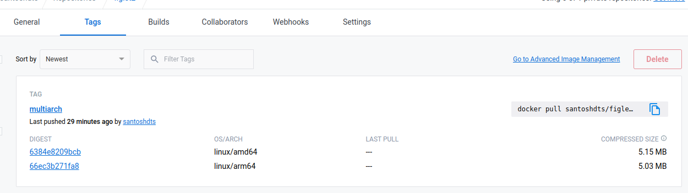

# Advanced Builds in Docker

Docker around its `19.x` release updated its current *Builder* with the new image buiilder known as [**Buildkit**](https://github.com/moby/buildkit). The oifficial definition of the Builkit is outlined as **BuildKit is a toolkit for converting source code to build artifacts in an efficient, expressive and repeatable manner.**

Buildkit provides much needed features for building Docker images like, Faster Build time by leveraging efficient caching mechanism and by parallelizing building independent build stages, Building Multi-Architechure builds, etc. Thus improving the current experience in performance, storage management, and extensibility.

The above features can be accessed on a locally installed Docker setup is by using the command `buildx`

The following features/commands are provided by the `buildx` command

```bash
santosh@~*$:docker buildx

Usage:  docker buildx [OPTIONS] COMMAND

Extended build capabilities with BuildKit

Options:
      --builder string   Override the configured builder instance

Management Commands:
  imagetools  Commands to work on images in registry

Commands:
  bake        Build from a file
  build       Start a build
  create      Create a new builder instance
  du          Disk usage
  inspect     Inspect current builder instance
  ls          List builder instances
  prune       Remove build cache
  rm          Remove a builder instance
  stop        Stop builder instance
  use         Set the current builder instance
  version     Show buildx version information

Run 'docker buildx COMMAND --help' for more information on a command.
```
One of the command used with `buildx` is the regular `build` command. Docker `buildx` is a Docker Plugin which extends the existing Docker `build` command, which provides some new features provided by the Buildkit mechanism. `buildx` executes all the processes in Parallel making the whole build process much faster.

```bash
 santosh@figlet*$:docker buildx build -t santoshdts/figlet2 .
WARNING: No output specified with docker-container driver. Build result will only remain in the build cache. To push result image into registry use --push or to load image into docker use --load
[+] Building 2.0s (6/6) FINISHED                                                                                                        
 => [internal] load build definition from Dockerfile                                                                               0.0s
 => => transferring dockerfile: 429B                                                                                               0.0s
 => [internal] load .dockerignore                                                                                                  0.0s
 => => transferring context: 2B                                                                                                    0.0s
 => [internal] load metadata for docker.io/library/alpine:latest                                                                   2.0s
 => [1/3] FROM docker.io/library/alpine:latest@sha256:bc41182d7ef5ffc53a40b044e725193bc10142a1243f395ee852a8d9730fc2ad             0.0s
 => => resolve docker.io/library/alpine:latest@sha256:bc41182d7ef5ffc53a40b044e725193bc10142a1243f395ee852a8d9730fc2ad             0.0s
 => CACHED [2/3] RUN apk update && apk update                                                                                      0.0s
 => CACHED [3/3] RUN apk add figlet
 ```
 As you can see, the whole build process was completed in 2.0 seconds (**Building 2.0s (6/6) FINISHED**), Apart from this, we can even push the build artefact directly to our registery (If the Build process was succussful) if we append the command with `--push` flag.

 Another feature of Buildx is building an image for multiple architecures. For the above example we didn't specify any perticular paltform and it was built for `linux/amd64`


Now, if we build another image from the same Dockerfile, tag it and add the `--platform linux/amd64,linux/arm64` flags and push it to the repository. We would see two different images built witha single command.

```bash
santosh@figlet*$:docker buildx build -t santoshdts/figlet2:multiarch --platform linux/amd64,linux/arm64 . --push
[+] Building 27.7s (14/14) FINISHED                                                                                                             
 => [internal] load .dockerignore                                                                                                          0.0s
 => => transferring context: 2B                                                                                                            0.0s
 => [internal] load build definition from Dockerfile                                                                                       0.0s
 => => transferring dockerfile: 429B                                                                                                       0.0s
 => [linux/arm64 internal] load metadata for docker.io/library/alpine:latest                                                               6.2s
 => [linux/amd64 internal] load metadata for docker.io/library/alpine:latest                                                               4.8s
 => [auth] library/alpine:pull token for registry-1.docker.io                                                                              0.0s
 => [linux/arm64 1/3] FROM docker.io/library/alpine:latest@sha256:bc41182d7ef5ffc53a40b044e725193bc10142a1243f395ee852a8d9730fc2ad         0.8s
 => => resolve docker.io/library/alpine:latest@sha256:bc41182d7ef5ffc53a40b044e725193bc10142a1243f395ee852a8d9730fc2ad                     0.0s
 => => sha256:9b18e9b68314027565b90ff6189d65942c0f7986da80df008b8431276885218e 2.71MB / 2.71MB                                             0.7s
 => => extracting sha256:9b18e9b68314027565b90ff6189d65942c0f7986da80df008b8431276885218e                                                  0.1s
 => [linux/amd64 1/3] FROM docker.io/library/alpine:latest@sha256:bc41182d7ef5ffc53a40b044e725193bc10142a1243f395ee852a8d9730fc2ad         0.0s
 => => resolve docker.io/library/alpine:latest@sha256:bc41182d7ef5ffc53a40b044e725193bc10142a1243f395ee852a8d9730fc2ad                     0.0s
 => CACHED [linux/amd64 2/3] RUN apk update && apk update                                                                                  0.0s
 => CACHED [linux/amd64 3/3] RUN apk add figlet                                                                                            0.0s
 => [linux/arm64 2/3] RUN apk update && apk update                                                                                         5.4s
 => [linux/arm64 3/3] RUN apk add figlet                                                                                                   2.7s
 => exporting to image                                                                                                                    12.5s 
 => => exporting layers                                                                                                                    0.1s 
 => => exporting manifest sha256:6384e8209bcbcb4ea65aa9b96192fa44beaf3ff83a66134a63682b06d0092692                                          0.0s 
 => => exporting config sha256:dadb123e30490f1d2fd69a369ac198433f39486b67709b4618804c58859bf166                                            0.0s 
 => => exporting manifest sha256:66ec3b271fa8019a988f5fd25b79acc485a7bd1d6dda3ad56b2135ea5a69217a                                          0.0s 
 => => exporting config sha256:dc6836e012fd07180fe11e202b7448fa261be0a2b9fea80fd600c93b8a691918                                            0.0s
 => => exporting manifest list sha256:864ccb19106a1c5aeb675ce1f1f3485107f8a78fcf120c910203b24417df9e99                                     0.0s
 => => pushing layers                                                                                                                     10.2s
 => => pushing manifest for docker.io/santoshdts/figlet2:multiarch@sha256:864ccb19106a1c5aeb675ce1f1f3485107f8a78fcf120c910203b24417df9e9  2.1s
 => [auth] santoshdts/figlet2:pull,push token for registry-1.docker.io                                                                     0.0s
 => [auth] santoshdts/figlet1:pull santoshdts/figlet2:pull,push token for registry-1.docker.io
  
  ``` 



## Buildx Bake

Baked builds are a high-level feature that can be used to define automated build pipelines. They lets you produce multiple images from a single build operation.

BuildKit supports high-level build concepts that go beyond invoking a single build command enabling efficient handles of multiple concurrent build requests and de-duplicating work. The build commands can be combined with general-purpose command runners (for example, `make`). However, these tools generally invoke builds in sequence and therefore cannot leverage the full potential of BuildKit parallelization, or combine BuildKit's output for the user. For this use case, we use a command called `docker buildx bake`.

The `bake` command supports building images from HCL, JSON and Compose files. This is similar to `docker compose build`, but allowing all the services to be built concurrently as part of a *single request*. If multiple files are specified they are all read and configurations are combined.


# Resources:
- [docker buildx Official Docker Docs](https://docs.docker.com/engine/reference/commandline/buildx/)
- [Docker Multi-platform images](https://docs.docker.com/build/building/multi-platform/)
- [How Docker Build Command Works Internally By Ivan Velichko](https://iximiuz.com/en/posts/you-need-containers-to-build-an-image/)