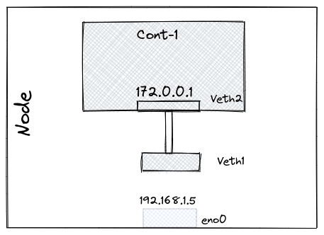
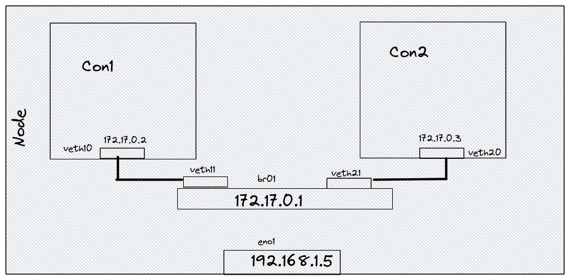

# Container Networking

One of the key aspects of containers is the ability to run multiple containerized applications at the same time, each with its own installations and dependencies. As we've seen in previous articles in this section applications are isolated inside the container from the host. All other containers are a full-featured Linux environment with their own users, file system, processes, and *network stack*. Thus, all applications inside the container are permitted to access or modify files or resources available inside the container only. One of the reasons Docker containers and services are so powerful is that you can connect them together, or connect them to non-Docker workloads. Docker containers and services do not even need to be aware that they are deployed on Docker, or whether their peers are also Docker workloads.

By default, when you create or run a container using `docker create` or `docker run`, it does not publish any of its ports to the outside world, enabling communication with the outside world. By default, the container is assigned an IP address for every Docker network it connects to. The IP address is set from the pool assigned to the network, so the Docker daemon effectively acts as a DHCP server for each container. Each network also has a default subnet mask and gateway.

Docker’s networking subsystem is pluggable, using drivers. Several drivers exist by default, and provide core networking functionality:
- `bridge` The default network driver. Bridge networks are usually used when your applications run in standalone containers that need to communicate.
- `host` : For standalone containers, remove network isolation between the container and the Docker host, and use the host’s networking directly.
- `overlay` You can also use overlay networks to facilitate communication between two standalone containers on different Docker daemons.
- `ipvlan` IPvlan networks give users total control over both IPv4 and IPv6 addressing. 
- `macvlan` Macvlan networks allow you to assign a MAC address to a container, making it appear as a physical device on your network. The Docker daemon routes traffic to containers by their MAC addresses. 
- `none` All networking disabled. Usually used in conjunction with a custom network driver. 

# The Container Networking Model

The Network needs to satisfy the following requirements.
- All containers can communicate with all other containers with [NAT](https://en.wikipedia.org/wiki/Network_address_translation).
- All Nodes can communicate with all the containers and vice-versa without NAT.
- The IP that a container sees itself as would be the same IP others sees it as.


As you can see, the container gets its own interface, its own Routing rules among others. To confirm this we can run `ifconfig` on the host we would see a list of interfaces and if we exec into the container and run the same command `ifconfig` w would get a different set of interfaces. 

the following is the list of interfaces running from my ubuntu container:

```bash
santosh@~*$:docker run -it  ubuntu bin/bash
root@bf0d4387d99e:/# ifconfig 
eth0: flags=4163<UP,BROADCAST,RUNNING,MULTICAST>  mtu 1500
        inet 172.17.0.2  netmask 255.255.0.0  broadcast 172.17.255.255
        ether 02:42:ac:11:00:02  txqueuelen 0  (Ethernet)
        RX packets 9814  bytes 25345852 (25.3 MB)
        RX errors 0  dropped 0  overruns 0  frame 0
        TX packets 7938  bytes 533232 (533.2 KB)
        TX errors 0  dropped 0 overruns 0  carrier 0  collisions 0

lo: flags=73<UP,LOOPBACK,RUNNING>  mtu 65536
        inet 127.0.0.1  netmask 255.0.0.0
        loop  txqueuelen 1000  (Local Loopback)
        RX packets 0  bytes 0 (0.0 B)
        RX errors 0  dropped 0  overruns 0  frame 0
        TX packets 0  bytes 0 (0.0 B)
        TX errors 0  dropped 0 overruns 0  carrier 0  collisions 0
```
This is different from the interfaces I have on my host.

To enable the container to talk to the host, we add a Virtual ethernet interface `veth`, which is like an ethernet cable. One end of the interface is connected to the network Namespace to the containers  `veth2` and the other end to the default Namespace, the host `veth1`. 



To enable this model we need to add some routing rules so that our container can talk to the host. To do this we can use the following commands on our host:
`sudo ip netns add con1` here con1 is our container name.

To create the veth pair:
`sudo ip link add veth1 type veth peer name veth2` 

Add one end of veth to the namespace (container):
`sudo ip link set veth2 netns con1`

Configuring the interface in the network namespace with an IP address:
`sudo ip netns exec con1 ip addr add 72.17.0.2 dev veth2`

Enable the interface inside the network namespace:
`sudo ip netns exec con1 ip link set dev veth2 up`

Enable the interface on the node:
`sudo ip link set dev veth1 up`

Set the loopback interface in the network namespace:
`sudo ip netns exec con1 ip link set lo up`

Set the routes on the node/host
`sudo ip route add 72.17.0.2/32 dev veth1`

Set the default route in the network namespaces
`sudo ip netns exec con1 ip route add default via 72.17.0.2/32 dev veth2`


## Inter Container Networking

This model is similar to the one discussed above. But, to enable communication between two separate containers apart from adding two `veth` pairs, there's another networking concept known as `bridge`, which enables this.  a bridge behaves like a network switch that packets between interfaces that are connected to it.




The only additional configuration needed to configure this setup other than the above configs is, we need to add the bridge network and assign an IP address to it. This can be achieved it by:
`sudo ip link add name br0 type bridge` here, we create a new interface pf `type` `bridge` and the name is `br0`.
`sudo ip addr add 172.17.0.1/24 dev br0` here, we are setting the IP to `br0`

This setup enables communication between two containers in the same node.


> I somehow messed up with my VM :(. hence could not share the hands-on experience. I will update this shortly.

# Resources:
- [Introduction to Linux interfaces for virtual networking](https://developers.redhat.com/blog/2018/10/22/introduction-to-linux-interfaces-for-virtual-networking#)
- [Container Networking from scratch Youtube](https://www.youtube.com/watch?v=6v_BDHIgOY8)
- [Mastering Container Networking](https://iximiuz.com/en/series/mastering-container-networking/)