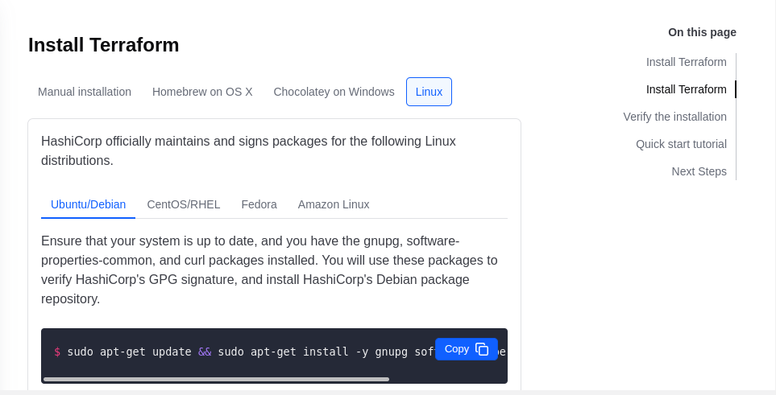
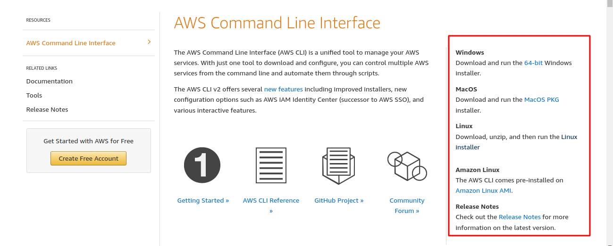
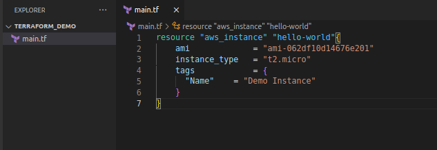
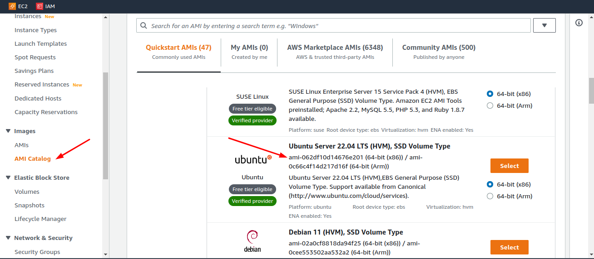
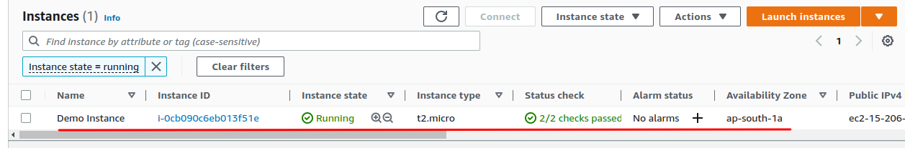
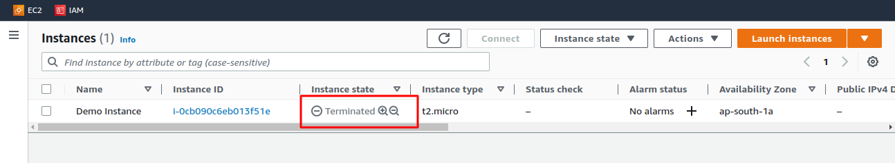

# Hello World with Terrform

Terraform is a deployment technology for anyone who wants to provision and manage their infrastructure as code (IaC). Terraform is a product developed in Go by **Hasicorp**. Some of the key characteristics of Terraform which make Terraform unique are as follows:

- Provisioning tool - It can Deploy infrastructure, not just applications.
- Easy to use - It uses a simple-to-understand language namely **HCL** (Hashicorp Configuration Language)
- Declarative - We just define what we want and not how to do it.
- Cloud-agnostic - We can Deploy to any cloud service provider using the same tool.
## Installing Terraform

Let's start with installing the tool first - Terraform.
We can navigate to this [installation guide](https://developer.hashicorp.com/terraform/tutorials/aws-get-started/install-cli) page of the official docs of Terraform to install the tool on our system.



As I am on a Linux system I've selected the relevant installation procedure for my environment. After following the instruction on the installation page, we should successfully install Terraform on our laptop.

```bash
vagrant@Terraform:~$ terraform
Usage: terraform [global options] <subcommand> [args]
The available commands for execution are listed below.
The primary workflow commands are given first, followed by
less common or more advanced commands.
Main commands:
init Prepare your working directory for other commands
validate Check whether the configuration is valid
plan Show changes required by the current configuration
apply Create or update infrastructure
destroy Destroy previously-created infrastructure
<snip>
.
.
.
<snip>
Global options (use these before the subcommand, if any):
-chdir=DIR Switch to a different working directory before executing the
given subcommand.
-help Show this help output or the help for a specified subcommand.
-version An alias for the "version" subcommand.
```

As we would be creating infrastructure on AWS, we need to download the AWS CLI and configure it with our AWS credentials. We can follow the installation instruction for AWS CLI is [provided here](https://aws.amazon.com/cli/). Follow the instruction for your OS from the menu on the right-hand pane.



Once, the AWS-CLI is installed we need to configure the same with AWS credentials, like so:

```bash
vagrant@Terraform:~$ aws configure
AWS Access Key ID [None]: <Access Key>
AWS Secret Access Key [None]: <Secret Access Key>
Default region name [None]: ap-south-1 # chose the default region of your choice
Default output format [None]:
vagrant@Terraform:~$
```

Once this is configured, we are ready to use Terraform to create our infrastructure on AWS.

## Creating an EC2 instance on AWS using Terraform

As Terraform reads the configuration files to create infrastructure using which we will instruct Terraform to create an EC2 instance on AWS. I have created a directory named`terraform_demo` in which I will create a Terraform config file named `main.tf`. The `.tf` extension signifies that it's a Terraform configuration file, so when this file is run it will read all the files with the `.tf` extension in the directory and join them together for taking action as defined in the config files.

Below you can see a simple *hello-world* example in Terraform that creates an EC2 instance in the *ap-south-1* region.



On line one-three we define the *provider block* which tells Terraform about which is responsible for understanding API interactions, making authenticated requests, and exposing resources to Terraform. A [provider in Terraform](https://registry.terraform.io/browse/providers) is a plugin that enables interaction with an API. This includes over 100 providers for various Cloud providers and Software-as-a-service providers.

```tf
provider "aws" { # Defines the Terraform Provider to use
region = "ap-south-1" # Defines which zone we need our Resource to be created
}
```
On line five we define the resource type and a name by :
```tf
<Element - resource> <Type> <Name>
resource "aws_instance" "hello-world"{
…
}
```

This EC2 code block is an example of a Terraform resource. Resources are declared as HCL objects with type resource and exactly two labels. The first label specifies the type of resource you want to create, and the second is the resource name.

On line six, we declare an [*Amazon Machine Image*](https://docs.aws.amazon.com/AWSEC2/latest/UserGuide/AMIs.html) as an `ami` object, which refers to a supported and maintained image provided by AWS that provides the information required to launch an instance. Here, I've selected `ami-062df10d14676e201` which could be region specific and an *Ubuntu Server 22.04 LTS (HVM), SSD Volume Type*.



On line seven, we declare `instance type` that comprises varying combinations of CPU, memory, storage, and networking capacity and give you the flexibility to choose the appropriate mix of resources for your applications. I have chosen it to be as `t2.micro` which is eligible in *Free Tier*.
On lines eight-nine, I've added a `tag` object for the above example that will add the Name and Owner tags will be added to the VPC on resource creation.

## Creating a resource from main.tf

Once our resource configuration file is done, we can move on with using this file to create an EC2 instance on AWS.
First, we need to install the AWS provider on our local machine, this can be achieved by using the `terraform init` command
We can check for any syntax error with our `main.tf` file by applying the `terraform validate` command.

```bash
vagrant@Terraform_demo*$:terraform validate
Success! The configuration is valid.
vagrant@Terraform_demo*$:
```

Once, we've initialized the Terraform config file, we are ready to deploy our first infrastructure on AWS. we can apply the`terraform plan` to check the changes the configuration will be made to our infrastructure. It does not apply any of the proposed changes. Instead, it creates a reviewable execution plan, which you can use to confirm that the proposed changes are expected.

```bash
vagrant@terraform_demo*$:terraform plan
Terraform used the selected providers to generate the following execution plan. Resource actions are indicated with the following symbols:
+ create
Terraform will perform the following actions:
# aws_instance.hello-world will be created
+ resource "aws_instance" "hello-world" {
+ ami = "ami-062df10d14676e201"
+ arn = (known after apply)
+ associate_public_ip_address = (known after apply)
+ availability_zone = (known after apply)
+ cpu_core_count = (known after apply)
+ cpu_threads_per_core = (known after apply)
+ disable_api_stop = (known after apply)
+ disable_api_termination = (known after apply)
+ ebs_optimized = (known after apply)
+ get_password_data = false
+ host_id = (known after apply)
+ host_resource_group_arn = (known after apply)
+ id = (known after apply)
+ instance_initiated_shutdown_behavior = (known after apply)
+ instance_state = (known after apply)
+ instance_type = "t2.micro"
+ ipv6_address_count = (known after apply)
+ ipv6_addresses = (known after apply)
+ key_name = (known after apply)
+ monitoring = (known after apply)
+ outpost_arn = (known after apply)
+ password_data = (known after apply)
+ placement_group = (known after apply)
+ placement_partition_number = (known after apply)
+ primary_network_interface_id = (known after apply)
+ private_dns = (known after apply)
+ private_ip = (known after apply)
+ public_dns = (known after apply)
+ public_ip = (known after apply)
+ secondary_private_ips = (known after apply)
+ security_groups = (known after apply)
<snip>
.
.
<snip>
Plan: 1 to add, 0 to change, 0 to destroy.
```

As you can see from the above exhaustive list of resources Terraform will create by making relevant API calls to AWS and the last line which displays the brief summary which says : *1 to add, 0 to change, 0 to destroy*.

Once, we are satisfied with the configurations, we are ready to deploy our infrastructure on AWS by using the `terraform apply` command. We need to confirm the process of creating the infrastructure by typing `yes` when prompted.

```bash
Do you want to perform these actions?
Terraform will perform the actions described above.
Only 'yes' will be accepted to approve.
Enter a value: yes
```

This will create an EC2 instance on AWS ap-south-1 region with Ubuntu 22.04 image as we specified. The output will be similar to the `terraform plan` command and we should see a similar summary of the output:

```bash
aws_instance.hello-world: Creating…
aws_instance.hello-world: Still creating… [10s elapsed]
aws_instance.hello-world: Still creating… [20s elapsed]
aws_instance.hello-world: Still creating… [30s elapsed]
aws_instance.hello-world: Creation complete after 32s [id=i-0cb090c6eb013f51e]
Apply complete! Resources: 1 added, 0 changed, 0 destroyed.
```


## Proceed to check our EC2 instance on AWS

We can log in to our AWS account and navigate to the EC2 service and check for running instances. You can see the instance we have created using the Terraform config file is created with our defined specifications with Tag *Demo Instance* applied as the name of the EC2 instance and the instance is in **Running** state.



## Destroy our infrastructure

In case we need to remove all the infrastructure we've created as we want to destroy any infrastructure you are no longer using, as it costs money to run stuff in the cloud. Terraform has a special command to destroy all resources: `terraform destroy`. When run this command would ask for confirmation and once confirmed.

```bash
Plan: 0 to add, 0 to change, 1 to destroy.
Do you really want to destroy all resources?
Terraform will destroy all your managed infrastructure, as shown above.
There is no undo. Only 'yes' will be accepted to confirm.
Enter a value: yes
```

It will go ahead and delete all the resources. Wait a few minutes for Terraform to resolve, and then you will be notified that Terraform has finished destroying all resources. Your output will look like the following:

```bash
aws_instance.hello-world: Destroying… [id=i-0cb090c6eb013f51e]
aws_instance.hello-world: Still destroying… [id=i-0cb090c6eb013f51e, 10s elapsed]
aws_instance.hello-world: Still destroying… [id=i-0cb090c6eb013f51e, 20s elapsed]
aws_instance.hello-world: Destruction complete after 30s
Destroy complete! Resources: 1 destroyed.
```
We can go ahead and check for the deletion of the resources on the AWS console.



We can also verify the deletion process on our cli by applying the `terraform show` command. As there are no resources created by the Terraform currently, and confirming that it returns nothing.
As we experienced, creating and destroying infrastructure on the cloud becomes such an easy task leveraging the power of Terraform becomes such an easy task.

In upcoming sessions, we shall move ahead and undertake of provisioning some intermediate to complex infrastructure on AWS and other Providers.

# Resources:
- [Build Infrastructure - Terraform tutorials](https://developer.hashicorp.com/terraform/tutorials/aws-get-started/aws-build)