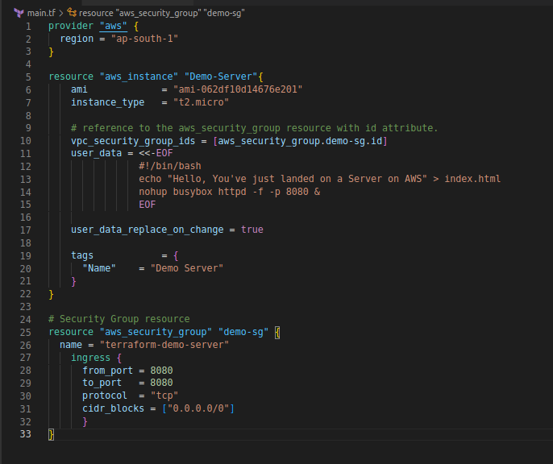
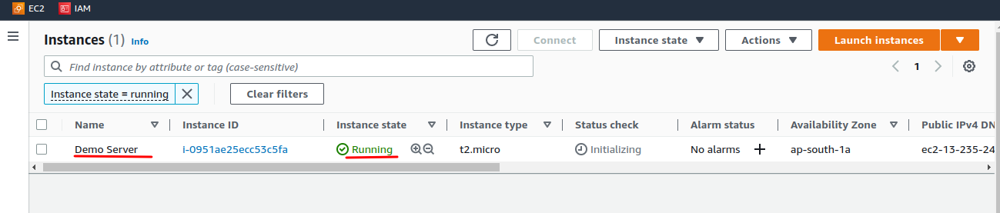
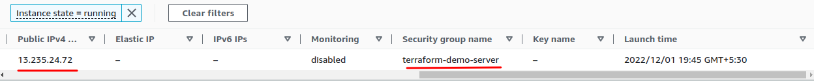
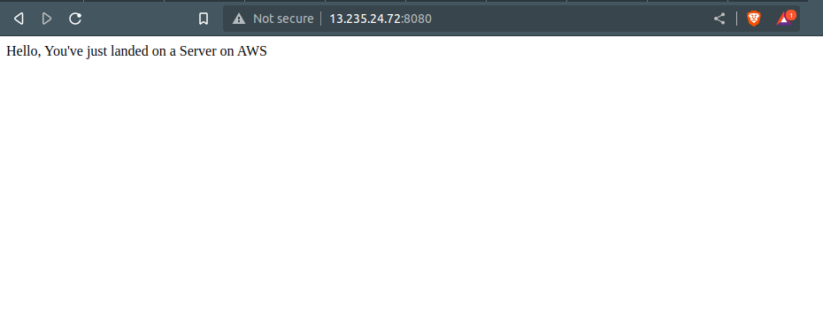

# A simple Web Server on AWS using Terraform


We are going to build upon our [last session](./25-terraform.md), where deployed a simple EC2 instance on AWS. In this session, we are going to deploy a simple that responds to HTTP requests.

We will run a simple Bash script that returns *Hello, You've just landed on a Server on AWS* when run.

```bash
#!/bin/bash
echo "Hello, You've just landed on a Server on AWS" > index.html
nohup busybox httpd -f -p 8080 &
```

This just writes the above message to the `index.html` and runs a default tool installed by Ubuntu named `busybox` and serves that file on port `8080`, I've chosen port 8080 instead of the default port 80 because if chose to run the Server on port 80 we need to provide *Root user Privileges* to our Server. The `nohup` command and the ampersand - `&` make the server run *permanently* in the background.

In this example we would be using EC2 instances **User Data** configuration provided by Terraform. This will make the EC2 instance execute the shell script the very first time it boots up. We can leverage this Terraform feature by passing the `user_data` argument to our Terraform code that we've written already.

From the above image of Terraform code, you might have noticed some commands like `<<-EOF` and `EOF`. These are advanced Bash commands known as [*heredoc*](https://tldp.org/LDP/abs/html/here-docs.html) helpful in creating multiline strings without inserting `\n` at the end of each line.

The `user_data_replace_on_change` argument this when set to `true` and if the `user_data` parameter is changed. This will tell Terraform to terminate the earlier instance and recreate a new one with the new `user_data` parameter. As the `suer_data` is run on the first instance of the Booting of our instance and when the instance is already running and we make any changes to the `user_data` that would not get applied. Hence, to make our instance apply the new `user_data` script we need to re-create our instance by destroying the earlier instance.

We also need our EC2 instance to receive traffic on port 8080. By default, AWS does not allow traffic to and from an EC2 instance. To enable this communication on our EC2, we need to create an [*Security Group*](https://docs.aws.amazon.com/vpc/latest/userguide/VPC_SecurityGroups.html) to control the traffic to our EC2 instance and link it to our Server.

```tf
resource "aws_security_group" "demo-sg" {
    name = "Demo Server instance "
    ingress {
        from_port = 8080
        to_port = 8080
        protocol = "tcp"
        cidr_blocks = ["0.0.0.0/0"]
    }
}
```
The above code snippet would create a new AWS resource called *aws_security_group* and will specify that this group will accept all the traffic on `port 8080` from anywhere ( as specified in the `cidr_blocks` argument). To link this security group with our EC2 instance, we would provide another argument namely `vpc_security_group_ids`. We would achieve this by using Terraform *Expressions*.

An Expression in Terraform is something that returns a value, as we've provided a value of the argument `instance_type` as `ap-south-1`. An Expression can be of any type like *strings*, *Numbers*, etc. The Expression type we would be using in this example would be of type *reference*. This means we would be passing a reference to an out put of a different resource written in our Terraform code. The syntax for providing *reference expression* is as follows:

`<PROVIDER>_<TYPE>.<NAME>.<ATTRIBUTE>`

Here, the provider we know is `AWS`, the type would be `security_group`, the name of the security group, and the attribute will be one of the many attributes exported by the resource, in our case it would be `id`. As we are adding a reference from another reference we are creating an *implicit dependency*. Terraform parses all the dependencies and builds a dependency graph, which we'll see later.

So our expression to the above reference would be like so:

`aws_security_group.demo-sg.id`

Our final code would be something like this:



We will use `terraform init` to install any resources and run `terraform validate` to check for any errors in our code.

```tf
santosh@terraform-demo*(main)$:terraform validate
Success! The configuration is valid.
```

we are ready to apply this configuration to provision our webserver on AWS. But, let's first see what action would Terraform perform and the action it would take. We would do this by using the `terraform plan` command:

```bash
Plan: 2 to add, 0 to change, 0 to destroy.
```

This is the summary of our infrastructure that would be created if we apply our code and we are ready to apply the configuration. After applying the Terraform code, AWS created both resources and configured them accordingly:

```bash
santosh@terraform-demo*(main)$:terraform apply
<snip>
.
.
<snip>
aws_security_group.demo-sg: Creating…
aws_security_group.demo-sg: Creation complete after 2s [id=sg-0fad382922e65eaa9]
aws_instance.Demo-Server: Creating…
aws_instance.Demo-Server: Still creating… [10s elapsed]
aws_instance.Demo-Server: Still creating… [20s elapsed]
aws_instance.Demo-Server: Creation complete after 21s [id=i-0951ae25ecc53c5fa]
Apply complete! Resources: 2 added, 0 changed, 0 destroyed.
We can check the created resources on AWS console:

External IP and Security Group created accordingly:

```
And finally, we can test our Server by accessing it through the External IP provided by AWS on 8080. In this instance, we have got an external IP `http://13.235.24.72` and we can access our server like so:
`http://13.235.24.72:8080/` or by simply using `curl`



```bash
santosh@90DaysOfDevOps*(main)$:curl http://13.235.24.72:8080/
Hello, You've just landed on a Server on AWS
```

In the above example, we used two resource types in a single Terraform code. In the next session, we shall see yet another powerful feature of Terraform **Variables** and different types of Variables which we can leverage and make our code dynamic and avoid the *Don't Repeat Yourself* principle.

Do not forget to destroy the infrastructure we provisioned by applying the `terraform destroy` command and confirm by using the `terraform show` command.