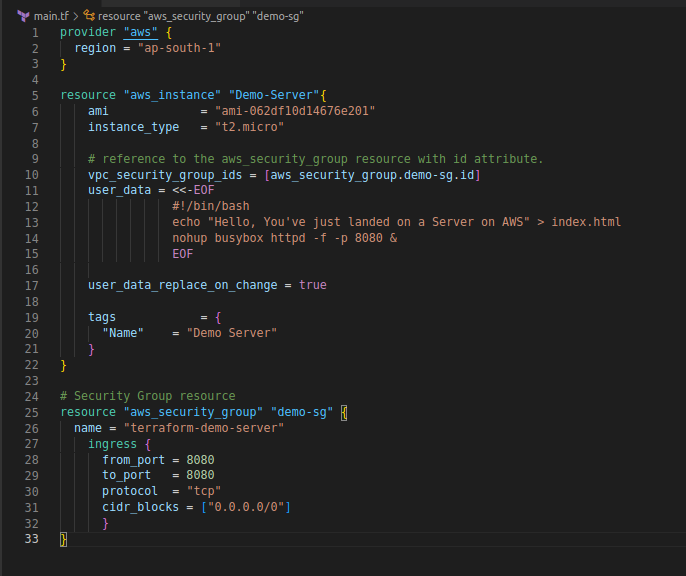
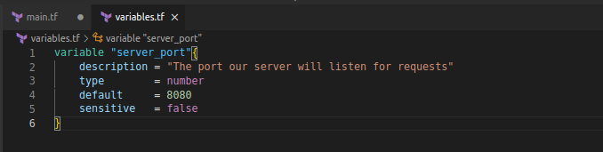

# Variables in Terraform

While writing our Terraform code, we might need to provide references to many parameters of our code. Terraform allows us to write our code in conformance with the *DRY* principle and make it more configurable. It would help us to consider our Terraform code as *Functions*, this concept allows us to pass parameters to our fictions as variables. In Terraform language these variables are known as [*Input Variables*](https://developer.hashicorp.com/terraform/language/values/variables).

We can define input variables by creating a new file with the name `variable.tf` and syntax like so:

```tf
variable "<Variable Name>{
<Variable decleration>
…
}
```

While declaring a variable, we can configure the following optional parameters. We will
be able to see this description not only while reading the code but also when running the `terraform plan` or `apply` commands.

- *description*: In this argument, we can briefly describe the purpose of each variable using the optional description argument

- *default*: If the `default` argument is present, the variable is considered to be optional and the default value will be used if no value is set when calling the module or running Terraform. The default argument requires a literal value and cannot reference other objects in the configuration. We can pass it via a command line flag using `-var` or `-var-file` options.

- *type*: This argument allows us to enforce *type constraints* while defining the variable. [Terraform supports](https://developer.hashicorp.com/terraform/language/values/variables#type-constraints) a number of type constraints, including string, number, bool, list, map, set, object, tuple, and any. When defined with desired *type constraint* on a variable, it helps in catching simple errors when terraform parses the code.

- *validation*: You can specify custom validation rules for a particular variable that go beyond basic type checks, such as enforcing minimum or maximum values on a number.

- *sensitive*: While passing secret information to the variable e.g., passwords, API keys,
etc.. *sensitive* option will not log the value of the variable when we run `plan` or `apply` command.

## Example of the Input variable

We will consider our [earlier code for creating a web server](./26-web-server.md) for passing an input variable to that.



As you can see, we are passing the port number in many places, which could be avoided using the input variable feature of Terraform. We need to create another file named `variables.tf` which will contain all our input variables. In this case, we will declare a variable `server_port`.

```tf
variable "server_port"{
description = "The port our server will listen for requests"
type: = number
default = 8080
sensitive = false
}
```

Once, the variable declaration is done, we need to call it in our `main.tf` file. First, we will set the variable value to the `aws_security_group`'s `ingress` block with the following syntax while referring to a variable `var.<Variable_Name>`. We would apply this to our code like so:

```tf
ingress {
from_port = var.server_port
to_port = var.server_port
protocol = "tcp"
cidr_blocks = ["0.0.0.0/0"]
}
```

Now, apply the variable inside the string literal in the `user_data` script. We would be using a concept known as *string interpolation* with the syntax `${…}` as follows:

```bash
user_data = <<-EOF
#!/bin/bash
echo "Hello, You've just landed on a Server on AWS" > index.html
nohup busybox httpd -f -p ${var.server_port} &
EOF
```

our final code would be like this:


And our variable file would look like this:



Now, If we `apply` our code, we would get the same resource on AWS as with the [earlier example](./26-web-server.md).
## Output Variables
In addition to the input variables, Terraform allows yet another variable to reference type output values - *Output Variables*. Output variables allow us to export data about our resources, which we can use to configure other parts of your infrastructure with automation tools. The syntax is as follows:
```tf
output "Name"{
value = <Value>
<config>
…
}
```
Apart from the `description`, and `sensitive` parameters that we have discussed in input variables. Output variables support another parameter known as `depends_on`.

Terraform automatically figures out your dependency graph based on the references within your code, but in some conditions, we might need to give some pointers about the dependency we like to inject. As in our above example, the *external IP* of our instance can be made available on our console and for any further usage via the output variable.
The following code is added to our `variable.tf` file. Our variable definition would be something like this:

```tf
output "external_ip"{
value = aws_instance.Demo-Server.public_ip
description = "The public IP address of our web server"
}
```

If we apply the above configuration, apart from creating the resources on the AWS. We would also receive output for the *External IP* provided by AWS after creating the resources.


We can also check all the pre-defined output variables provided by our resource by using the `terraform output` command. As, you can see we are able to communicate with our Web Server.