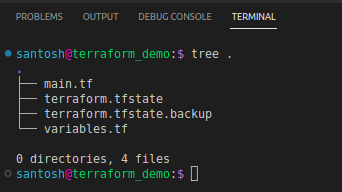
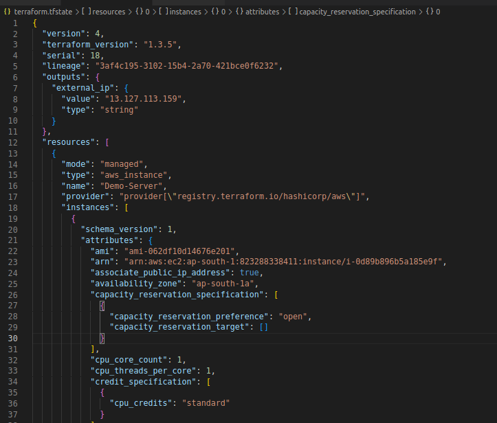
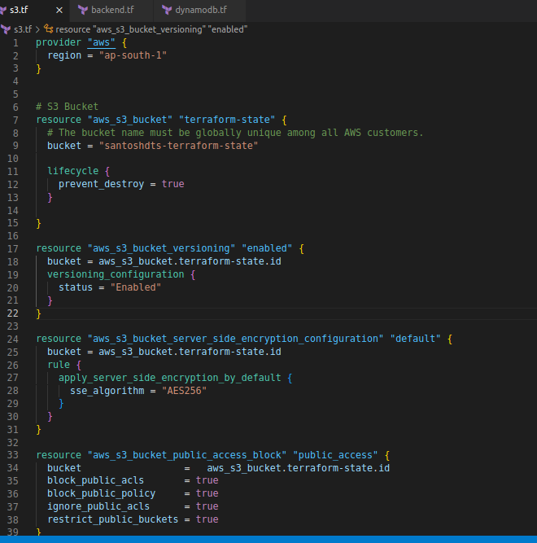
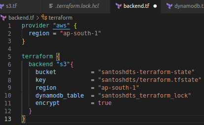

# What is Terraform state and Remote Backends?

## Terraform state

One interesting aspect in our last examples while creating infrastructure with Terraform is that whenever we apply the `terraform init` or `terraform plan` command, Terraform destroys and recreates the resource. This is because Terraform doesn't have information about the previously created IAM modules. This would sometimes be an issue if you've had a Database and accidentally we or someone from our team applied `terraform init` to our code. That would destroy and recreate the Database. That would be a disaster.

Fortunately, Terraform provides us with a feature to navigate such scenarios and also enables us to seamlessly work in teams without worrying about the current state of our infrastructure provisioning with Terraform.

## Enter Terraform State

Whenever we create an infrastructure, Terraform records the information about it in a special file named `terraform.tfstate` in our working directory.

This file contains JSON formatted data that records a mapping from the Terraform resources in code with that of existing in the real world (AWS in our example). The following is the extract from the `terraform.tfstate` file for the infrastructure we created in [our last example](./27-tf-variables.md)

When we apply our code, Terraform looks at this file and finds that the resource type is `aws_instance` and the name of the instance is `Demo-Server` in our AWS account. This JSON file also contains minute details of the resources provisioned by our Terraform configuration.

Now if we make any changes to our code, Terraform looks at the state file and figures out what changes need to be made to bring the desired change in the real world.

For simple projects, a state file stored locally also known as *local backend* on our laptop is not a problem. But, when the project grows and there are different teams working on the same infrastructure would surely create some complexities.

## Storing Terraform state

Where would you store your state file? As other team members also need access to the same infrastructure and its concerned state file. The ideal place to store the state would be in some shared location. The ideal location for storing the terraform state file is by using Terraform's built-in functionality for _remote backends_ which determines how Terraform will load and share the state. Terraform supports several remote backends, including *Amazon S3*, *Azure Storage*, *Google Cloud Storage*, and *HashiCorp's Terraform Cloud* and *Terraform Enterprise*.

Terraform stores the information in the state file in plain text format. Sometimes, resources created by Terraform need to store sensitive data about our infrastructure. for example, if you use the aws_db_instance resource to create a database. To overcome any security risks, we can leverage the in-built encryption mechanisms of the above-mentioned storage providers, for example using IAM policies with an Amazon S3 bucket which is typically your best bet as a remote backend.

*It's designed for 99.999999999% durability and 99.99% availability* which makes our data on Amazon S3 Highly Available. The data is encrypted at rest (Amazon S3 supports server-side encryption using AES-256) and in transit (Terraform uses TLS when talking to Amazon S3).

Once, you solve the accessibility issue by making the state available on a shared location. Now, suppose two members are working on the same file simultaneously *you can run into race conditions as multiple Terraform processes make concurrent updates to the state files, leading to conflicts, data loss, and state file corruption.* Terraform State Locking feature will make sure that the state is *Locked* if it's presently in use by another user.

The Amazon S3 bucket with DynamoDB tables can be utilized for enabling locking. This helps in mitigating any configuration mismatch when multiple team members are working on the same Terraform code. This workflow also helps in versioning our terraform configuration via state files. Amazon S3 bucket with DynamoDB stores every revision of your state file and we can roll back to an older version if something goes wrong.

We can also support a workflow to isolate different environments while working with our infrastructure. A modification in one environment, for example, *staging* should not affect the *production* or the *development* teams' workflow.
## Hands-on with AWS S3 bucket as Remote Backend

> We need to have an AWS S3 bucket and DynamoDB created firsdt for storing our Terraform state file.

First, we need to create an Amazon S3 bucket in our `main.tf` file.

In the above code snippet, we need to assure that the *bucket name* is globally unique among all AWS customers. As you can see we've set the `prevent_destroy` parameter to `true`. This assures that the *bucket* resource does not get deleted accidentally. Any attempt to delete that resource (e.g., by running terraform destroy) will cause Terraform to exit with an error.

The `aws_s3_bucket_versioning` resource is set to `true`, this ensures every update to a file in the bucket creates a new version of that file. Next, we set up the encryption on the state files stored on the AWS S3 bucket. For this, we set the `aws_s3_bucket_server_side_encryption_configuration` resource with `sse_algorithm` as `AES256`. As our state files may contain some sensitive data like passwords, etc we need to configure the access to the state file stored on the S3 bucket. For this, we use the `aws_s3_bucket_public_access_block`. In our code, we block all public access to the bucket.

To use DynamoDB for *locking* the state file with Terraform, you must create a DynamoDB table that has a primary key called **LockID** using the `aws_dynamodb_table` resource.
Once, we have created all the configurations for creating the Amazon S3 bucket and a DynamoDB table. We need to tell Terraform to use this configuration and enable encrypting and storing the Terraform state file on the AWS S3 bucket. We need to define the remote backend as defined on lines 81 to 89. One thing to note here is the `key` property on the backend. We need to provide the path for storing our `terraform.tfstate` file on the S3 bucket. In our example, I have provided it with *santoshdts/terraform.tfstate*.

Once the S3 and DynamoDB tables are configured appropriately. We can create a `backend``.`tf` telling Terraform that our default backend for storing the state file is AWS S3 and will be using DynamoDB for locking. 

# resources:
- [How to manage Terraform state - Gruntwork](https://blog.gruntwork.io/how-to-manage-terraform-state-28f5697e68fa)