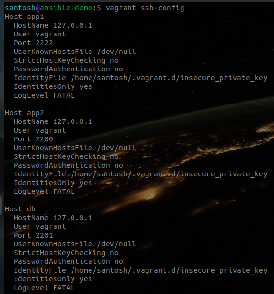
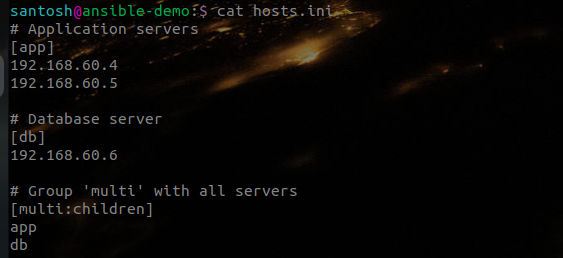
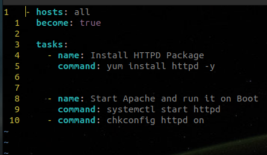
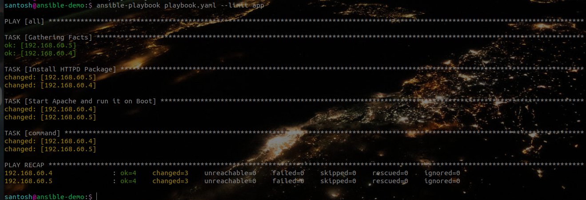
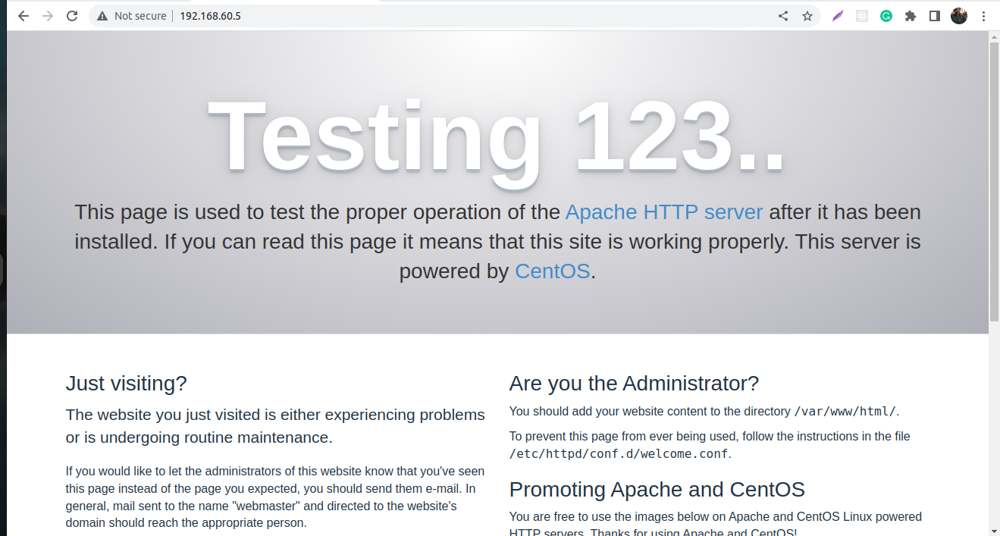
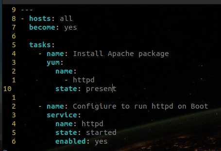
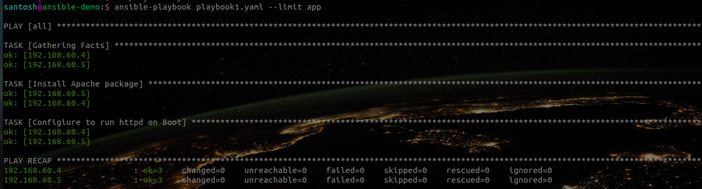

# Installing Apache web server using Ansible Playbook

In this session, we shall install the `httpd` package on our server running on *Centos-7*. This is just an example showing how we can leverage Ansible to configure our servers whether on the cloud or on-prem.

I have spun up three servers for this task, all running on Centos-7 using Vagrant, the Vagrantfile used for the same can be found here.

The servers have been configured with the IP addresses and hostnames for access by the Ansible tool:

We need a way to tell Ansible which servers we want to work on. This is done by defining our hosts in a special file called `hosts.ini`. I have created this file in the root of my current working directory.

> For production uses cases, we have a defined set of servers. The hosts file is located in /etc/ansible/hosts
In this file, we define all the servers we like to configure using Ansible. As you can see we have grouped them according to their functionality. Grouping of servers is achieved by enclosing the name of the group - **[app]** and **[db]** in square brackets. Just below our groups, we can declare our servers. I have provided their respective IP addresses. We can also give these servers their hostnames.

Once we have defined our hosts and our servers running. we are ready to configure them to our requirements. I will be installing the `httpd` package on the servers in the **[app]** group. We can achieve this in many ways using Ansible.
Ansible allows us to execute plain shell commands on our servers via playbooks and we can also improve things greatly by using some of Ansible's built-in modules.

## Installing httpd with shell scripts in Playbooks

In the example below, I am using shell commands in Ansible Playbook to install httpd package:

As you can see, Ansible Playbooks are written in **YAML** format. On the first line, we define the list of servers we want to operate on. In this example, I've defined it as `all`. This tells us to operate on all the hosts defined in the `hosts.ini` file. In the next line, I've used an argument called `become:`. This tells Ansible to run all the commands through `sudo`, so the commands will be run as the root user. Next is `tasks:`, telling Ansible that what follows is a list of tasks to run as part of this *play*.

The first task begins with defining the `name` of the task. it's a way of giving a human-readable description of the task that follows. Next, we define the `command` to be executed as a task. We use Ansible's *command module* to run standard shell commands. And, you might be well versed with the command for installing httpd using yum.
In the next block of tasks, I've started the Apache service with similar commands used in the block above.

## Running Playbooks

Once our Playbook is ready, we can run it with the `ansible-playbook` command. For our example, I run `the ansible-playbook playbook.yaml - limit app` command. Here, the `playbook.yaml` is our Playbook file, and the ` - limit app` flag ensures that the tasks defined in the Playbooks are executed on the servers within the **[app]** group.

While running the Playbook You might notice some information about **Facts** on the terminal. In Ansible Facts are data gathered about hosts that need to be configured. Ansible facts are stored in JSON format and are helpful to the sysadmin to manage the hosts based on their current condition rather than taking actions directly without having any info about the system's health.

Then we see, the Tasks being executed on the defined hosts. In our example, it's been executed on the servers in the app group. Finally, we get the summary of the executed Playbooks where the `changed=3` field shows the number of tasks executed successfully on respective servers.

We can check the result of this by navigating on our browser and trying to reach one of our servers by its IP address. We should be greeted by the Apache test page:

That's great progress. We have successfully managed to configure `httpd` on two of our servers. within seconds using Ansible. Just imagine the amount of time and other complexities reduced in configuring hundreds of servers by using configuration management tools like Ansible.

## Playbooks using Ansible Modules

In the above example, we used simple shell commands in our Playbook. Ansible provides built-in modules to be used in Playbooks to handle some heavy lifting. Following is a Playbook using Ansible modules which does exactly the same configuration as above:

As you can see, it's written in YAML and uses Ansible's modules like `yum` and `service`. By using Ansible's declarative approach, we can describe to Ansible exactly what we want. We achieve this declarative functionality by using the `state:` argument. We tell `yum` to make sure the packages are installed with `state: present`, but we could
also use `state: latest` to ensure the latest version is installed, or `state: absent` to make sure the packages are not installed. Similarly, for our second block of the task we describe the `state: started` as we want it to be in a running state and we want it to run at system startup, so we say `enabled: yes`.

With this playbook format, Ansible can keep track of the state of everything on all our servers. If you run the playbook the first time, it will provide the server by ensuring Apache is installed and running, and your custom configuration is in place. Now, If run this Playbook the second time it won't actually do anything besides tell you nothing has changed. You can see this from the changed tab in the **PLAY RECAP** it displays `changed=0`.

Playbooks are the crux of Ansible's configuration management functionality, and the same modules and similar syntax can be used with [*ad-hoc commands*](https://docs.ansible.com/ansible/latest/command_guide/intro_adhoc.html#:~:text=An%20Ansible%20ad%20hoc%20command,but%20they%20are%20not%20reusable.) for deployments and server management.

# Resources
- [Using Ansible Playbooks - Ansible Docs](https://docs.ansible.com/ansible/latest/playbook_guide/index.html)
- [What is Ansible Playbook - Red Hat Blog](https://www.redhat.com/en/topics/automation/what-is-an-ansible-playbook)
- [Automate EVERYTHING with Ansible! (Ansible for Beginners) - Techno Tim on YouTube](https://youtu.be/w9eCU4bGgjQ)
- [Ansible Playbooks for Beginners - Hands-On by KodeKloud on Youtube](https://youtu.be/Z01b9QZG0D0)