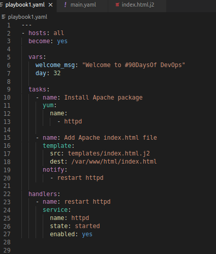
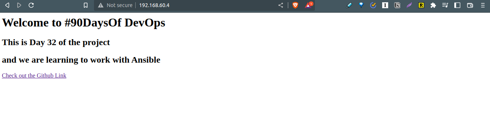
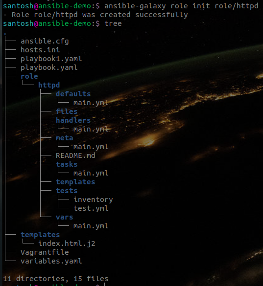
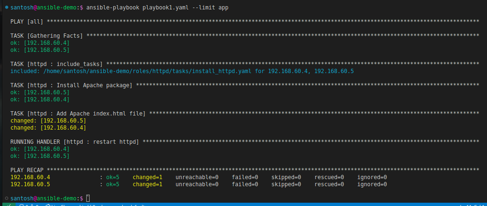
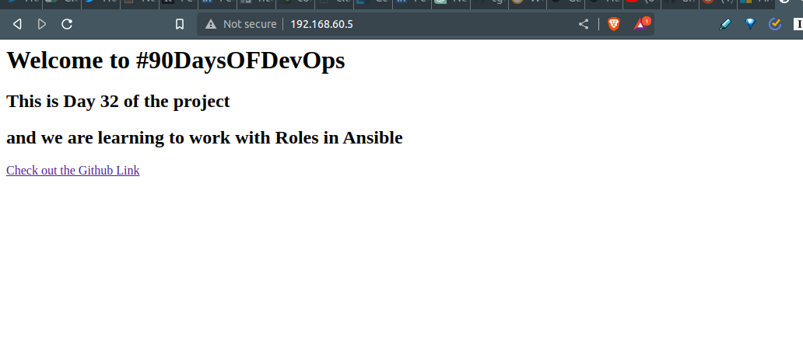

# Handlers and Roles in Ansible

In the [last session](./30-ansible-playbooks.md) we configured our servers by installing httpd package. As time goes on and projects grow, additional playbooks and variable files are added, and task files may be split. To follow the best practice by way of organizing all the tasks in a more efficient way so we can make playbooks more maintainable, reusable, and powerful. Ansible provides flexible features by providing us the tools necessary to split up tasks more efficiently using **Includes** and **Roles**. In this session, we will build upon the earlier example and use [Ansible Galaxy command](https://docs.ansible.com/ansible/latest/galaxy/user_guide.html#galaxy-user-guide) to make use of roles and includes.

> All the manifest file for this demo can be [found here](./ansible-demo/)

Before jumping on to Roles, let's check out Handlers in Ansible. Sometimes you want a task to run only when a change is made on a machine. For example, you may want to restart a service if a task updates the configuration of that service, but not if the configuration is unchanged. Ansible uses handlers to address this use case. **Handlers** are tasks that only run when notified.

In the Playbook, I've added another play and some variables and added a template file to our server at `/var/www/html` to display a custom page. I've also added a `notify` property to that task. Here the `notify` keyword instructs the `Add Apache index.html file` task to run the Handlers - `restart httpd` in our case.



Then from line 22 onwards, we define our handler. Which is a task in itself, which will run every time we make a modification in the `Add Apache index.html file` task and will restart the Apache service. As we have modified Apache's default welcome page.

## Variables
As you might notice, I have provided some variables in the Playbook. Alternatively, One of the ways we can use variables is by creating a separate `variables.yaml` file in the same directory and declaring all the required variables in that file, and reference that file in our playbook using the `vars_files` keyword:

```yaml
---
- hosts: all
become: yes
vars_files:
- variables.yaml
```

After running this playbook using either of the methods, we get the same result. We should see our custom welcome message as we navigate to one of our servers.



## Roles

Currently, we have two tasks and a Handler in our playbook, This can grow exponentially as we work on our projects, where we will have to add more configurations to our servers. We might end up with something resembling Russian nesting dolls. That is where Ansible Roles comes to the rescue.
Ansible Roles allows us to include Playbooks inside other Playbooks. Roles bring together these different facets of Ansible code creation to provide a fully independent collection of variables, tasks, files, templates, and modules that can be reused again in different playbooks. Roles have a structured layout on the filesystem. We can use the `ansible-galaxy role init` command, which will help us build skeleton directory structures for new roles.

We can see that the above command has scaffolded the directory structure for the httpd Role. When creating a role, not every directory or file is required. Only files that exist will be processed. We shall move our current project with the newly created **role/httpd**.
Once, we have the skeleton ready for our httpd role, we shall start to configure our role. First, we will move our current tasks in the Playbook to the tasks directory in the roles folder. Accordingly, we will move the templates, handlers, variables, and any other content to relevant folders. Now, the contents of various folders in the `roles` will include as fllowing:

`tasks` folder would include a `install_httpd.yaml` file:

```yaml
- name: Install Apache package
yum:
name:
- httpd
- name: Add Apache index.html file
template:
src: templates/index.html.j2
dest: /var/www/html/index.html
notify:
- restart httpd
```

and the `main.yaml` would be used to import that task within our playbook:

```yaml
 - -
# tasks file for role/httpd
- include_tasks: install_httpd.yaml
```

The `var` folder will include the declared variables in the `main.yaml` file:

```yaml
 - -
# vars file for role/httpd
welcome_msg: "Welcome to #90DaysOFDevOps"
day: 32
```

The `templates` folder will include our `index.html.j2` **jinja** template file:

```html
<html>
<h1>{{ welcome_msg }}</h1>
<h2> This is Day {{ day }} of the project </h2>
<h2>and we are learning to work with Roles in Ansible</h2>
<a href="https://github.com/Santosh1176/90DaysOfDevOps" alt=githublink>Check out the Github Link</a>
</html>
```

And finally, the `handlers` folder will include a `main.yaml` which would be triggered from our playbook.

```yaml
 - -
# handlers file for role/httpd
- name: restart httpd
service:
name: httpd
state: started
enabled: yes
```

## Calling Roles from the Playbook

Once we've configured all the roles in relevant directories. we are ready to use that role in our `playbook1.yaml` file:

```yaml
 - -
- hosts: all
become: yes
roles:
- httpd
```

We just call the role `httpd` and that's it. Ansible will take of importing all the relevant configuration details from the roles directory and configure our servers.

AS we apply our playbook with the same `ansible-playbook playbook1.yaml - limit app` command, we can see the servers being configured.



You can see in the **TASK** header that the tasks were imported from roles we had defined:

```bash
TASK [httpd : include_tasks] *****************************************************************************************************************
included: /home/santosh/ansible-demo/roles/httpd/tasks/install_httpd.yaml for 192.168.60.4, 192.168.60.5
```

After applying the playbook with roles configured, we get the same configuration on our server. The main difference is that all the peices of configuration are segregated according to their responsibility and our project is more structured.

