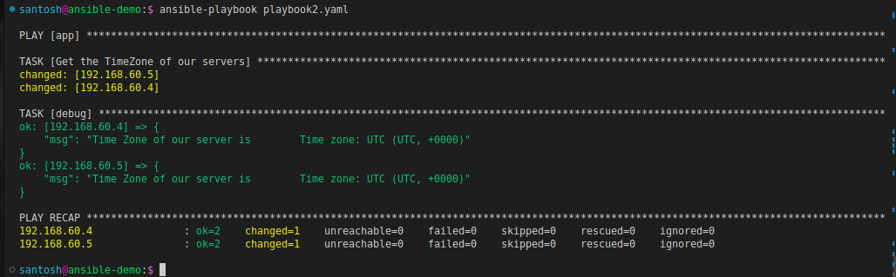

# Variables in Ansible

One of the key features of Ansible is **variables**. In the previous sessions, we did use some variables in our project, in this session we shall look closely at some of the ways Ansible provides in dealing with variables.
The simplest way to define variables is to put a vars section in your playbook. We did declare some variables in our Playbook in one iteration of our earlier session, with the names and values of your variables.

```yaml
vars:
wecome_msg: "Welcome to #90DaysOfDevOps"
day: 32
```

Similarly, we can also use a separate variables file by using the `vars_files` keyword in our project. We can declare all the variables in a `yaml` file like so:

```yaml
var_files:
- my_variable_file.yaml
```

While using **Roles**, we do get a dedicated folder with the name `vars` with a `main.yaml` file, where we can declare all our variables required.

While working on projects, we would require to set the value of the variable based on the result of a task. In such cases, we can use **registered variable** using the `register` clause.

```yaml
 - -
- hosts: app
become: true
gather_facts: false
tasks:
- name: Get the TimeZone of our servers
shell: "timedatectl | grep -i zone"
register: timezone
- debug: msg="Time Zones of our server are {{ timezone.stdout }}"
```

This Playbook will execute the command to check the time zone of our servers, and save that value in a `timezone` variable using the `register` keyword. Later, we access the variable in the `debug` clause to output the value to `stdout`.



We also encountered another clause **debug** in the above-executed Playbook. The `debug` keyword allows us to output the value of the variable or to print out an arbitrary message and the `shell` module has the same output structure as the command module.

## Facts in Ansible

Whenever we executed a Playbook, we might have noticed the console printing

```yaml
TASK [Gathering Facts]************************************
ok: [192.168.60.4]
ok: [192.168.60.50]
.
.
```

When Ansible gathers facts, it connects to the hosts and queries them for all kinds of details about the hosts: CPU architecture, operating system, IP addresses, memory info, disk info, and more. This information is stored in variables that are called facts, and they behave just like any other variable.

To view the **Facts** of our server, we can collect facts of our servers using a particular module called `setup`. We can invoke it manually with the ansible command-line tool, like this:

`ansible app -m setup`

This command will output a huge `JSON` file with a dictionary whose key is `ansible_facts` and whose value is a dictionary with the actual facts' names and values. To get a specific fact from this file we can drill down into the file using the `filter=` parameter and target for the required value. For example, if we like to see the OS of all our servers deployed, we can use the following command:

`ansible all -m setup -a 'filter=ansible_os_family`


In this way, we would not need to `register` keyword to register our variables as Ansible creates these variables by using `service_facts` module. Using such specific values from the `service_facts`, we can use these as our variables using the `set_facts` module.


Using `set_facts` in playbooks:

```yaml
- name: Set httpd_state
  when: ansible_facts.services['httpd.service'] is defined
  set_fact:
    nginx_state: "{{ ansible_facts.services[' httpd.service']
    ['state'] }}"
```

In this session, we looked into Ansible Variables and Facts and saw how we can define and use them in playbooks. Moreover, we explored different options for sharing, setting, and referencing them to make our Ansible journey easier.

See you in the next session of my journey of learning DevOps tools and concepts in 90 days