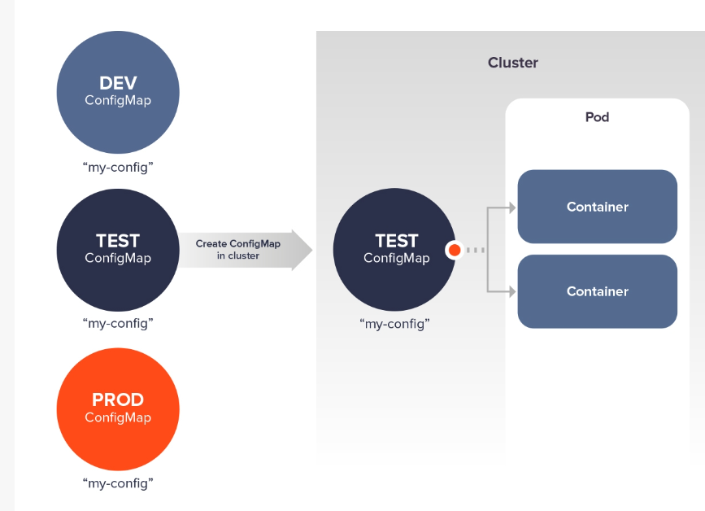

# ConfigMaps

In Kubernetes, There is always the need to decouple as much as enviornement specific configurations decoupled from the Appliation, which helps their application code inside a container portable. Kubernetes provides an API for such functionality, which enables DevOps engineers to store application specific *Non-Confidential* configuration in a saperate file called **configMaps**. This concept of saperating Application configuration from the Application code itself is in line with the *Twelev-Factor-App Methodology*, as Configurations may vary across deployment (development, production, and testing), but the application code remains the same.

An configMap is an API which hold key-value pairs for configuration data. With ConfigMaps, there’s no need to hardcode the configuration data in the Pod specification.You can think of them as way to represent something similar to the `/etc` directory, and the files within, on a Linux computer, Data held in a ConfigMap cannot exceed 1 MB and hence are designed not to store large volumes of data. Now, with `Kubernetes v1.19`, you can *create immutable ConfigMaps* and protect your deployments from accidental (or intentional) configuration changes.

We can create a configMap for each enviornmenet, specific for its deployment and then reference the same in the Pod definition file and configures the container(s) in that Pod based on the data in the ConfigMap. The Pod and the ConfigMap must be in the same namespace.

*image: Weave-works.com



```yaml
example-configmap.yaml

apiVersion: v1
kind: ConfigMap
metadata:
  name: game-demo
data:
  # property-like keys; each key maps to a simple value
  player_initial_lives: "3"
  ui_properties_file_name: "user-interface.properties"

  # file-like keys
  game.properties: |
    enemy.types=aliens,monsters
    player.maximum-lives=5    
  user-interface.properties: |
    color.good=purple
    color.bad=yellow
    allow.textmode=true
```
*ConfigMap like secret doest not contain `.spec` field, insted it contains `data` field to store the configuration data.*


## Creating configMap from a file:
A ConfigMap can be created from an individual file or from multiple files in any plaintext format using the kubectl create configmap.
`kubectl create configmap <configMap Name> --from-file <path/to/file>`


## Creating the configMap using multiple coonfiguration files fron a single directory
With this method, only regular files in the directories are packaged into the new ConfigMap and any other entries are ignored (e.g. subdirectories, symlinks, pipes, devices, etc).

`kubectl create configmap <configMap Name> --from-file <path/to/directory>`


## Creating configMap from literal values
`kubectl create configmap <configMap Name> --from-literal <key1=value1> --from-literal <key2=value2>`

There are mainly four methods to reference the created `configMap` in the Pod definition:  

- Inside a container using `command` and `args` field
- Environment variables for a container
- Add a file in read-only `volume` (configMap as Volume), for the application to read
- Write code to run inside the Pod that uses the Kubernetes API to read a ConfigMap


Here's an example Pod that uses values from game-demo to configure a Pod:
```yaml
apiVersion: v1
kind: Pod
metadata:
  name: configmap-demo-pod
spec:
  containers:
    - name: demo
      image: alpine
      command: ["sleep", "3600"]
      env:
        # Define the environment variable
        - name: PLAYER_INITIAL_LIVES # Notice that the case is different here
                                     # from the key name in the ConfigMap.
          valueFrom:
            configMapKeyRef:
              name: game-demo           # The ConfigMap this value comes from.
              key: player_initial_lives # The key to fetch.
        - name: UI_PROPERTIES_FILE_NAME
          valueFrom:
            configMapKeyRef:
              name: game-demo
              key: ui_properties_file_name
      volumeMounts:
      - name: config
        mountPath: "/config"
        readOnly: true
  volumes:
    # To consume a ConfigMap in a volume in a Pod:
    # You set volumes at the Pod level, then mount them into containers inside that Pod
    - name: config
      configMap:
        # Provide the name of the ConfigMap you want to mount.
        name: game-demo
        # An array of keys from the ConfigMap to create as files
        items:
        - key: "game.properties"
          path: "game.properties"
        - key: "user-interface.properties"
          path: "user-interface.properties"
immutable: true # Sects the ConfigMap as immutable
```
As above seeting the `configMap` as **immutable** prevents accidental changes to the configurations and increases the efficiency of the cluster by reducing the load on the `kube-API-server` by closing `watches` for ConfigMaps marked as immutable.

Once a ConfigMap is marked as *immutable*, it is not possible to revert this change nor to mutate the contents of the data or the binaryData field. You can only delete and recreate the ConfigMap. Because existing Pods maintain a mount point to the deleted ConfigMap, it is recommended to recreate these pods.


# Resources:
- [Twelev-Factor-App Methodology](https://12factor.net/)
- [A Guide to ConfigMap in Kubernetes](https://www.weave.works/blog/kubernetes-configmap)
- [Kubernetes Docs — ConfigMaps](https://kubernetes.io/docs/concepts/configuration/configmap/)

---

# [This was my Day 07](./07-lifecycle-and-probes.md)


# [Day 09](Update)