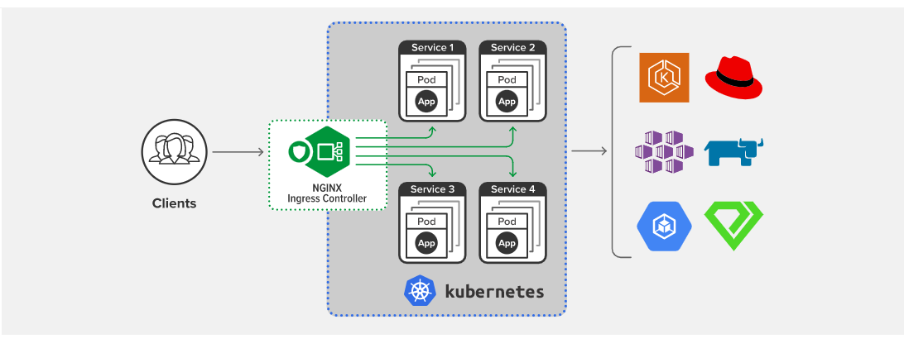

# Ingress

Ingress is a Kubernetes API that manages external traffic (HTTP and HTTPS) from outside the cluster and redirects it to **Service** inside the cluster. Other than routing external traffic, Ingress also provides TLS support, Name-based virtual hosting, and a Load Balancer feature for supported Cloud providers.

Traffic routing is controlled by rules defined on the Ingress resource. An Ingress controller is responsible for fulfilling the Ingress

[](https://mermaid.live/edit#pako:eNqNkstuwyAQRX8F4U0r2VHqPlSRKqt0UamLqlnaWWAYJygYLB59KMm_Fxdax-qmGwbuXA7DwAEzzQETXKutof0OPb8uaoUQkwKUu6hi3FwWM_QUHGBt0VFFt8DRQ2OWSGrKUUMlVQwMmhVLEV1Vcm--aUksiuXRaO_CEhkv4WjBvAkG1TrGaLa-iaUw6a0DcwaI-WgOsF7zq-pF881fvRx1UDzeiFq7ghb1kgqFWiElyTjnuXVG74FkbdumefEuuNuRm_4jZ1pqQ7L5fL6YQPb3NiGuyzsGt_-ihNyUkm6YSONWkjVNM8WUIyaeOJJ-upOnDuRDX4ahHMo888XHjA2YyLGKFEOmVjjHHZiOCh7-xmHw1tjtoIMakzDl0FIvXR2-zSlYqXd6_akYJs54yLHvOXWwEjQ8ZIdJS6X9VR-5cNok8fQFDdrgOg)


With Ingress, you can easily set up rules for routing traffic without creating a bunch of Load Balancers or exposing each service on the node. This makes it the best option to use in production environments. 
## Shortfalls of Service

If we need to expose the pods hosting our application to the traffic coming from outside the cluster, one way is to create a **Service** of type NodePort, which listens to outside traffic on an Ip address, and a HighPort which ranges from 30000 to 32676. Now, if a user needs to reach the application inside our Node they have to reach it by passing the ur; with the Port number (NodePort) we have defined in our Service. It would be similar to `curl 244.12.17.125:30008`. We could add a Proxy that listens on Port 80, and add a DNS record inside our `/etc/hosts file which would redirect all the traffic to the NodePort we've defined. In this scenario, our customer would simply enter `https://example.com` and our client would land on the application we hosted inside the cluster using the Service we've defined.

Now if we add another application that serves some other features of our application and is containerized in a different Pod. We need to create another Service and again expose it to the traffic outside the cluster in the same way as done before. This makes the process becomes cumbersome, as we have to distribute all the IP and port combinations to our users. If the number of services offered by our application increases, this could further complicate the matter. We need to provide our users with a simple DNS name through which they can access our application and its various features. This is made easily possible by the implementation of **Ingress** in Kubernetes.   


## Ingress Controllers as a remedy 

Ingress can be considered as a Layer-7 LoadBalancer for our Kubernetes Cluster. But, Kubernetes installation does not come pre-installed with the Ingress controller. In order for the Ingress resource to work, the cluster must have an ingress controller installed and running. The most common Ingress controller for Kubernetes is [NGINX Ingress Controller](https://kubernetes.github.io/ingress-nginx/deploy/) which is supported by Kubernetes or from the [List of Ingress Controllers](https://kubernetes.io/docs/concepts/services-networking/ingress-controllers/#additional-controllers). 

The Ingress controllers have built-in intelligence built into it to monitor the Kubernetes cluster for new definitions or Ingress resources and configure the Ingress controller deployed on our cluster. 

> Even with the Ingress installed on our cluster, We still need to expose our application via a Service to make it accessible to the traffic coming from outside the cluster. We can either expose it via a NodePort or a Cloud-native LoadBalancer on supported cloud platforms.

In this example we would use the most common Ingress Controller — Nginx Ingress Controller:



Nginx Ingress controller can be installed in our cluster just like any other Deployment.

```yaml
apiVersion: extensions/v1beta1
kind: Deployment
metadata:   
  name: nginx-ingress-controller
spec:
  replicas: 1
  selector: 
    matchLabels:
      name: nginx-ingress
  template: 
    metadata:
      labels: 
        name: nginx-ingress
    spec:
      containers:
        - name: nginx-ingress-controller
          image: quay.io/kubernetes-ingress-controller/nginx-ingress-controller:0.21.0
      args: 
        - /nginx-ingress-controller  # This is the command to start teh Ingress controller service
        - --configmap=$(POD_NAMESPACE)/nginx-ingress-config
      env:
        - name: POD NAME
          valueFrom:
            fiefldRef:
              fieldPath: metadata.name
        - name: POD_NAMESPACE
          valueFrom:
            fieldRef:
              fieldPath: metadata.namespace
      ports:
        - name:http
          containerPort: 80
        - name: https
          containerPort: 443

```
## confogMaps for storing various Ingress controller-required config data.

This installation of the Nginx Ingres controller requires certain configuration settings like Path to store the logs, KeepAliveThreshold, SSL settings, SessionTimeOuts, etc. These settings can be decoupled from the Nginx Controler image. We can pass these configurations in a `configMap`

```yaml
apiVersion: v1
kind: configMap
metadata:
  name: nginx-ingress-config
data:
```

## Service is still the main interface

We would also need a Service to expose the Ingress-Controller to the external world. So we create a Service of type `NodePort`:

```yaml
apiVersion: v1
kind: Service
metadata:
  name: nginx-ingress-service
spec:
  type: nodePort
  ports:
  - port: 80
    targetPort: 80
    protocol: TCP
    name: http
  - port: 443
    targetPort: 443
    protocol: TCP
    name: https
  selectors:
    name: Nginx-ingress-controller  # Link this service to the Nginx-Ingress-Controler Deployment
```

The Ingress controller also needs a ServiceAccount to interact with the Pods within the Cluster with desired permission with `Roles`, `ClusterRoles`, and `RoleBindings` 

```yaml
apiVersion: v1
kind: ServiceAccount
metadata:
  name: Ingress-sa
```
With all the above components, we would be ready with a basic implementation of an Ingress Controller.
To study the full list of requirements for installation of Nginx-Ingress-Controller using Manifests check out the Nginx [official docs](https://docs.nginx.com/nginx-ingress-controller/installation/installation-with-manifests/).


## Ingress Resources
An Ingress Resource is a set of Rules and Configurations applied on the Ingress Controller. We can configure rules to define forward specific traffic to a specific Pod based on the Path specified in the URL, and routing the traffic based on the Domain name itself. The Ingress resource can be created with a Kubernetes definition file:

```yaml
apiVersion: extensions/v1beta1
kind: Ingress
metadata:
  name: ingress-name
sepc:  # The spec is the section where we define all the rules for the Ingress
  rules:
  - http:
      paths:
      - path: /testpath  # This rule defines Any trafic coming from path /testpath will be redirected tobelow mentioned          # service, here "test" 
        pathType: Prefix
        backend:
          service:
            name: test   # This is where all the traffic from /testpath will be redirected to.
            port:
              number: 80
```
  


## Ingress Rules for Routing

Each HTTP rule contains the following information:

- An optional host. In this example, no host is specified, so the rule applies to all inbound HTTP traffic through the IP address specified. If a host is provided (for example, foo.bar.com), the rules apply to that host.
- A list of paths (for example, /testpath), each of which has an associated backend defined with a `service.name` and a service.port.name or `service.port.number`. Both the host and path must match the content of an incoming request before the load balancer directs traffic to the referenced Service.
- A backend is a combination of Service and port names as described in the Service doc or a custom resource backend by way of a CRD. HTTP (and HTTPS) requests to the Ingress that matches the host and path of the rule are sent to the listed backend.
- A defaultBackend is often configured in an Ingress controller to service any requests that do not match a path in the spec.

All the traffic with no rules will be always routed to a **DefaultBackend** that should handle requests in that case. Similar to a `404 page`. If no `.spec.rules` are specified, `.spec.defaultBackend` must be specified.

Each path in an Ingress is required to have a corresponding path type, You can find the details of the [Pathtypes here](https://kubernetes.io/docs/concepts/services-networking/ingress/index.html#path-types).

## Resources: 
- [Kubernetes Ingress: Medium Blog](https://medium.com/@jaygorrell/kubernetes-ingress-82aa960f658e)
- [Kubernetes Ingress Controller overview](https://medium.com/swlh/kubernetes-ingress-controller-overview-81abbaca19ec)
- [Ingress - Kubernetes Docs](https://kubernetes.io/docs/concepts/services-networking/ingress/index.html#path-types)
- [Ingress Controllers](https://kubernetes.io/docs/concepts/services-networking/ingress-controllers/)
- [Nginx-Ingress Controller](https://www.nginx.com/products/nginx-ingress-controller/)
- [Installing Nginx Controller with Manifests](https://docs.nginx.com/nginx-ingress-controller/installation/installation-with-manifests/)
- [Supported Ingress Controllers](https://kubernetes.io/docs/concepts/services-networking/ingress-controllers/#additional-controllers)
- [Ingress Class](https://kubernetes.io/docs/concepts/services-networking/ingress/#ingress-class)
