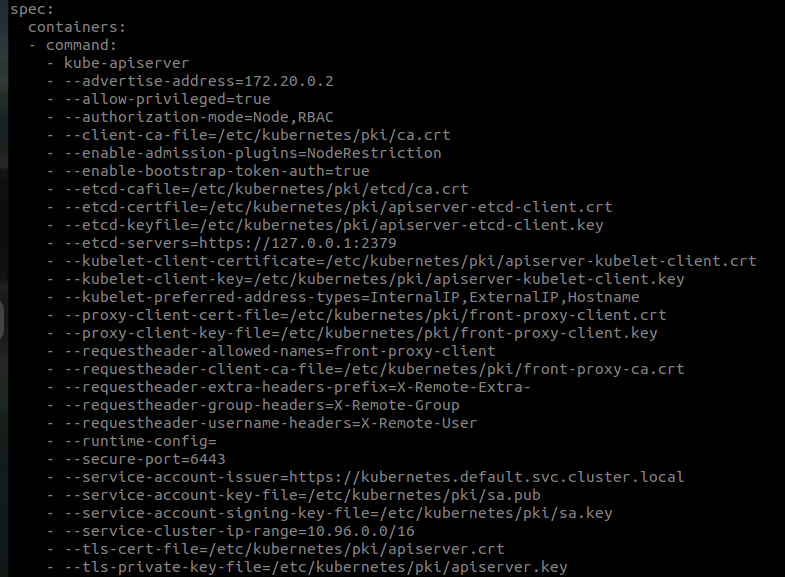

# Authentication in Kubernetes

As we are aware, as users we interact with kube-apiserver for various operations provided by Kubernetes. There is also a category of `Bots` aka Pods which also needs to communicate with various elements of Kubernetes, for instance, inter-Pod communication, etc. Every process from within or outside the cluster, either from a human user typing `kubectl` on a workstation, to `kubelets` on nodes must authenticate when making requests to the API server, or be treated as an anonymous user. In Kubernetes, **Authentication** means validating the identity of who or what is issuing the request, and all the communication with the cluster needs to be secure.

For a human user, presenting a valid *Root Certificate* signed by the cluster's Certificate Authority (CA) is considered authenticated. However, in contrast to the authentication mechanism for Pods, Authentication for Pods is bound to specific namespaces and can be created automatically by the API server or manually through API calls. Such objects in Kubernetes are known as Service accounts which are tied to a set of credentials stored as Secrets, which are mounted into pods allowing in-cluster processes to talk to the Kubernetes API.

Kubernetes does not manage user accounts natively. There are many ways to authenticate users. 
- By storing usernames and passwords in a static file by passing `basic-auth-file=<path to file containing user details>` to the API server.
- By creating and storing a static Token in a file by passing `token-auth-file=<path to a token file containing user details>` to the API server.
> Both of the above-mentioned authentication methods are not recommended approaches, as they are not secure. And we need to pass in the auth files every time we make a request to the API Server.
- By creating TLS certificates and passing them to the API server
- By connecting to a third [arty authenticating service like LDAP etc.

We shall be mainly concerned with generating and passing the TLS certificates in this article. There are mainly three types of certificates required while authenticating a User or a Server:

- `client-cert`: The certificate which needs to be presented by the clients to authenticate with the `kube-apiserver`.
- `server-cert`: The certificate which needs to be presented by the Servers on the Kubernetes system to authenticate themselves. These certificates can be of `kube-apiserver` and `etcd`. 
> `kube-apiserver` apart from acting like a server for all the components within the cluster and for requests coming from outside the cluster. It also acts like a client to the `etcd` and `kubelet` for making requests. Hence, `kube-apiserver` also needs a `client-cert` file.
- `ca-cert`: This is also known as Root Certificate, which lets you provision TLS certificates signed by a Certificate Authority (CA) that you control. These CA and certificates can be used by your workloads to establish trust. The `Kubernetes controller manager` provides a default implementation of a signer.

> **A quick hint on naming convention in certificate files. Usually, certificates with public keys are the ones ending with `.crt` or `.pem`. Similarly, Private keys file end with `.key` extension or contain a key in their file names for example `-key.pem`.** 

If you check your pod definition file of the `kube-apiserver-controlplane` present in the `kube-system` namespace. You shall see all the relevant certificates required for and to communicate with kube-apiserver.

## Generating Certificates

There are different tools available for generating TLS certificates. some of them include **EASYRSA, OPENSSL, CFSSL, etc**. We will use OpenSSL for this example.

To generate the CA certificate, we first create a Private key by passing `openssl genrsa -out ca.key 2048` command. This will generate the private key fr us to generate the various certificate file required. To generate the CA certificate we create an `Certificate Signing Request` by passing `openssl req -new -key ca.key -subj "/CN=KUBERNETES-CA" -out ca.csr`. Which generates the `csr`. Finally we sign the certificate by passing `openssl x509 -req -in ca.csr -signkey ca.key` command. This generates our certificate file with `.crt` extension, which we can use to authenticate our CA. Going forward,  we will use these key pairs to sign other Client and Server Certificates.

For generating all the Server and Client certificates, we use the same steps as outlined above. Remember to enter the Valid **Common Name — CN** field while generating teh `csr` for the client you are generating the certificate for example:
`openssl req -new -key ca.key -subj "/CN=Frontend-Dev" -out ca.csr`.  But, for Signing the `csr` we use the CA certificate and key for example `openssl x509 -req -in frontend-dev.csr -CA ca.cert CAKey ca.key -out frontend-dev.crt` to get the client certificate for our *Frontend-dev client*, which the user will use to authenticate to the Kubernetes cluster.

> To give any CLinet the Admin privilages to deffernciate this user with other users and giving them the authority to `approve` or `Deny` the `csr` generated by other clients. This can be done by passing Group details to the `csr` of the ADMIN `/O=system-masters` along with the `CN`

All of the Client certificates are stored in a special file on our system known as *Kubeconfig* which usually is stored in our Home directory inside `~/.kube/config` 

Client certificate authentication is enabled by passing the `--client-ca-file=<cert file path>` to the API server. The presented Client certificates must be validated by a Certificate Authority.

For a human user to Authenticate the user with the Kube-APIServer, a user needs to create a `Certificate Signing Request`. This creates a Kubernetes Object `csr`, which a Cluster Administrator can review and either `Approve` by passing `kubectl certificate approve` or use `kubectl certificate deny` to `Deny` the request. Once approved, the administrator can extract and provide a signed certificate to the requesting client or user. However, this method cannot scale with large organizations as it requires manual intervention. To overcome this utilizing an enterprise PKI, which can sign the client-submitted `CSR` and the signing authority can send signed certificates back to clients. This approach requires the private key to be managed by an external solution.

## The Service Account

Service Account is another Kubernetes resource (like pods, deployments, etc.). Processes in containers inside pods can also contact the apiserver. When they do, they are authenticated as a particular `Service Account` (for example, default).
Unlike user accounts, the Service Account is namespaced so you can create multiple Service Accounts with the same name as long as they live in different namespaces. When we create a Pod without a Service Account, it is automatically assigned the `default` service account in the same namespace.

Service Accounts are proxies for performing limited actions for users that have no access to sensitive data and systems.
By default, the service account credentials are mounted to the pods through a `secret`.
You can inspect the contents of the certificate by describing the `Secret` connected with the `serviceaccount`.

> ** Authentication concepts mentioned in this post are key to the next step in Kubernetes — *Authorization*. This section covers all the permission an Admin can grant to a Pod or a Client interacting with Kubernetes cluster with concepts known as *Role Based Access Controls — RBAC***  

# resources:
- [Authentication in Kubernetes](https://kubernetes.io/docs/reference/access-authn-authz/authentication/)
- [Managing TLS in Kubernetes](https://kubernetes.io/docs/tasks/tls/managing-tls-in-a-cluster/)
- [Working with Service Account In Kubernetes- Medium Blog](https://medium.com/the-programmer/working-with-service-account-in-kubernetes-df129cb4d1cc)