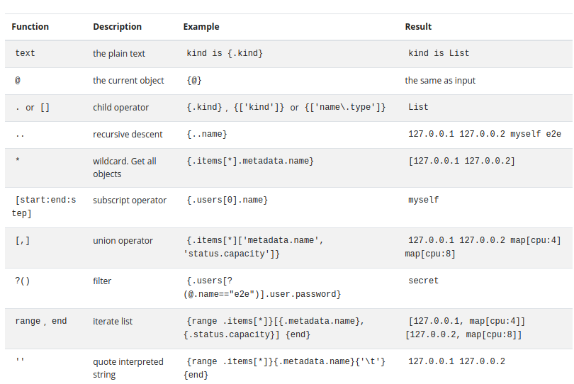

# YAML 

If you have been working with Kubernetes or Containers, I am sure you might have run into YAML files to configure and create our Kubernetes objects. In this write-up, I attempt to introduce you to the basics of the YAML file and some of the data structures used in YAML. Later in this post, we would explore yet another Kubernetes functionality to work with JSONPATH to get custom information from our deployed objects in Kubernetes.

The official documentation of `yaml` calls it as *YAML Ain't Markup Language™* and defines it as *YAML is a human-friendly data serialization
language for all programming languages.* It is a serialization language that has grown in popularity in the last few years.

To further dive deep into Yaml's structure, let's consider an example file of a Deployment object in Kubernetes :
```yaml
apiVersion: v1
kind: Pod
metadata:
  name: multi-pod
  namespace: test
spec:
  restartPolicy: Never
  volumes:
  - name: shared-data
    emptyDir: {}
  containers:
  - name: nginx-container
    image: nginx
    volumeMounts:
    - name: shared-data
      mountPath: /usr/share/nginx/html
  - name: ubuntu-container
    image: ubuntu
    volumeMounts:
    - name: shared-data
      mountPath: /pod-data
    command: ["/bin/sh"]
    args: ["-c", "echo Hello, World!!! > /pod-data/index.html"]
```

As we can see from the above example, YAML mainly uses indentation for scope and begins each entry on its own line. As mentioned, *indentation* is of utmost importance in YAML. Each entry in a YAML file uses a colon and space (“: ”) to mark each `key/value pairs`. There are mainly three types of data structures in YAML, *Lists*, *Maps/Directories*, and finally, the *octothorpe `#`* used for comments. Another rule to consider is about using *Blank spaces* ( By convention, using two blank spaces is preferred) instead of *Tab*. This is to avoid inconsistencies in formatting, as *Tabs have been outlawed since they are treated differently by different editors and tools And since indentation is so critical to the proper interpretation of YAML, this issue is just too tricky to even attempt.* Each newline indicates the end of the previous field unless specified. 


## Map or Dictionaries
If we look specifically for the first two lines in our multi-pod example YAML manifest:
```yaml
apiVersion: v1
kind: Pod
metadata:
  name: multi-pod
  namespace: test
``` 
As we can see, a Map is a simple way to associate *name-value pairs*, which is convenient when you’re trying to set up configuration information. This can get more complicated, as you can see in the `metadata` field. Here, the key `metadata` maps to another map rather than a single `value` field. It further contains a map of the `name` and `namespace` fields. 

As YAML is a superset of JSON, we can view the YAML files as JSON file structures. For the above example, the JSON equivalent of the same would be:
```json
{
    "apiVersion": "v1",
    "kind": "Pod",
    "metadata": {
        "name": "multi-pod",
        "namespace": "test",
    }
}
```
As you can see, it's a map within a map.

## List or Arrays

```yaml
foods:
  - Apple
  - Orange
  - Strawberry
  - Mango
```
A list in YAML is a sequence of objects that can have any number of items in it. Lists start with a dash `-` indented for two spaces from its parent element, as shown in the above snippet. To further complicate the structure, let's see a list containing a map.:
```yaml
volumeMounts:
    - mountPath: /usr/share/nginx/html
      name: shared-data
      readOnly: true
```
Here, `volumeMounts` is a complex structure, which is a list that contains a map within. The `mountPath` and `name` are a map within its parent `volumeMounts`. The `json` representation of the same could simplify viewing this:

```json
"volumeMounts": [
                    {
                        "mountPath": "/usr/share/nginx/html",
                        "name": "shared-data",
                        "readOnly": true
                    },
]
```                     
A bit more complex example for the same, where `volumeMounts` is a list of multiple maps would look like so:
```yaml
volumeMounts:
    - mountPath: /usr/share/nginx/html
      name: shared-data
    - mountPath: /var/run/secrets/kubernetes.io/serviceaccount
      name: kube-api-access-htkzm
      readOnly: true
```      
And its `json` representation would look like this:
```json
"volumeMounts": [
                    {
                        "mountPath": "/usr/share/nginx/html",
                        "name": "shared-data"
                    },
                    {
                        "mountPath": "/var/run/secrets/kubernetes.io/serviceaccount",
                        "name": "kube-api-access-htkzm",
                        "readOnly": true
                    }
                ]
```                


We can have many such similar simple and complex YAML structures while working in the field of DevOps. To summarize, we can have 

- maps, which are groups of name-value pairs

- lists, which are individual items

- maps of maps

- maps of lists

- lists of lists

- lists of maps


Now as we are femilier with the structure of the properties with wich a Kubernetes objects are made of, lets see how can we retrive some information tailored for our needs from the Kube-API server. 

# Enter JSONPATH

When dealing with production clusters, we would be dealing with hundreds and sometimes thousands of Kubernetes objects housed in multiple nodes. One of the most common methods to interact with te Kubernetes API to gather any informationan or logs of those objects would be through the `kubectl` utility. By now, you miught imagine a scenario where interacting with such enormus sums of Kubernetes objects to find custom information or metrics wiuyld be a daunting job. 

Worry not, Kubernetes provides yet another utility to to breeze through such large amounts of objects by making use of an `jsonpath` option coupled together with `kubectl`. We shall see some features of the JSONPATH, which we can leverage to gather critical information about the objects deployed on our clusters.

In the JSON world, JSONPATH is a query language when applied to a given JSON dataset gets you results that are subsets of the given dataset. We can apply JSONPATH queries to our YAML dataset to get desired values of a specific field in the YAML structure. For example, we need to find the value of the `namespace` example below:
```json
```json
{
    "apiVersion": "v1",
    "kind": "Pod",
    "metadata": {
        "name": "multipod",
        "namespace": "test",
    }
}
```
We can leverage the JSONPATH query to achieve this. As we can see, the above top-level map/dictionary doesn't have any name, such elements are known as **Root elements** in JSONPATH and it is denoted by a dollar symbol `$`. Now to access the value of the `namespace` we can apply the following JSONPATH query, `$.metadata.namespace`. As we are applying this on Kubernetes landscape, we can also use `.metadata.namespace`, like so:
```bash
santosh@~*$:k get pod -n test multipod -o jsonpath={.metadata.namespace}
test
santosh@~*$:k get pod -n test multipod -o jsonpath={$.metadata.namespace}
test
```
As you can see, we are drilling down the hierarchy of the elements of the structure i.e `namespace` is a chile element of the `metadata` field and we dig into it by using the dot `.` notation. Similarly to drill down and find the value of the `name` of the second `mountPath` element in our `volumeMounts` example, we can use the JSONPATH query like so, `$.volumeMounts[1].name`, which would result in `kube-api-access-htkzm`. Here, we are referencing the second element in the list, and lists as we are aware are *zero indexed*, hence, by referring `volumeMounts[1]` we are targetting the second element in that list and its `name` field.

Now suppose, we have hundreds of elements in the list that we want to target based on some prefix criteria. We can achieve this by using the inbuilt functionality of the JASONPATH query. For example, we want to list out the `name` of the `mountPath` of all the pods deployed in the `kube-system` namespace. We can achieve this by using the following query:
```bash
santosh@~*$:k get pod -n kube-system -o jsonpath='{.items[*].spec.containers[*].volumeMounts[*].name}'
config-volume kube-api-access-rl4kx config-volume kube-api-access-xc9q4 etcd-data etcd-certs cni-cfg xtables-lock lib-modules kube-api-access-xbxcp cni-cfg xtables-lock lib-modules kube-api-access-ttb87 ca-certs etc-ca-certificates k8s-certs usr-local-share-ca-certificates usr-share-ca-certificates ca-certs etc-ca-certificates flexvolume-dir k8s-certs kubeconfig usr-local-share-ca-certificates usr-share-ca-certificates kube-proxy xtables-lock lib-modules kube-api-access-7z9hm kube-proxy xtables-lock lib-modules kube-api-access-hgkvd kubeconfig
```

We can leverage jsonpath functions to get more complex outcomes from manipulating jsonpath queries. For example, we can write a new query for the same workflow as described above by we can iterate over the fields by using the inbuilt `range` function over the fields and printing the result on a new line.
```bash
ssantosh@~*$:k get pods -n kube-system -o jsonpath='{range .items[*]}{.spec.containers[*].volumeMounts[*].mountPath}{"\n"}{end}'
/etc/coredns /var/run/secrets/kubernetes.io/serviceaccount
/etc/coredns /var/run/secrets/kubernetes.io/serviceaccount
/var/lib/etcd /etc/kubernetes/pki/etcd
/etc/cni/net.d /run/xtables.lock /lib/modules /var/run/secrets/kubernetes.io/serviceaccount
/etc/cni/net.d /run/xtables.lock /lib/modules /var/run/secrets/kubernetes.io/serviceaccount
/etc/ssl/certs /etc/ca-certificates /etc/kubernetes/pki /usr/local/share/ca-certificates /usr/share/ca-certificates
/etc/ssl/certs /etc/ca-certificates /usr/libexec/kubernetes/kubelet-plugins/volume/exec /etc/kubernetes/pki /etc/kubernetes/controller-manager.conf /usr/local/share/ca-certificates /usr/share/ca-certificates
/var/lib/kube-proxy /run/xtables.lock /lib/modules /var/run/secrets/kubernetes.io/serviceaccount
/var/lib/kube-proxy /run/xtables.lock /lib/modules /var/run/secrets/kubernetes.io/serviceaccount
/etc/kubernetes/scheduler.conf
```

As you can see, we have used the `range` function to iterate over the `items` list, the asterisk `*` in the square brackets is known as *wildcard* which is used to denote all the indexes of the list. after iterating over the list of `items` for finding the `mountPath` of all the pods. We print the result on a new line `\n` and end the loop by the `{end}` statement. Similarly, we can range over more than one field to find any specific values and get the desired results.


From the jsonpath support document for Kubernetes, we can see that Kubernetes supports much complete functionality with jsonpath, as can be seen from the table below:



We can use this concept and take it forward by using other Unix commands to give more granular insights. For example, we can check all the logs of a particular *Namespace* or pods with specific *labels* and pipe it to `xargs` and run the `kubectl` command to get the logs of all the input objects and store it in *kube-system-logs.txt* file

`kubectl get pods -n kube-system -o jsonpath='{range .items[*]}{.metadata.name}{"\n"}{end}' | xargs -I {} kubectl -n kube-system logs {} > kube-system-logs.txt`

Now that was interesting!!
But, believe me, This is just the tip of the iceberg. We can go a step further and add another feature Kubernetes API provides by printing the values by *pretty printing* the result on a custom column with headers. For the same example as above, we can modify our query so that it can use the custom column functionality, like so:

```bash
 santosh@~*$:k get pods -n kube-system -o custom-columns='MOUNT PATH:.spec.containers[*].volumeMounts[*].mountPath'
MOUNT PATH
/etc/coredns,/var/run/secrets/kubernetes.io/serviceaccount
/etc/coredns,/var/run/secrets/kubernetes.io/serviceaccount
/var/lib/etcd,/etc/kubernetes/pki/etcd
/etc/cni/net.d,/run/xtables.lock,/lib/modules,/var/run/secrets/kubernetes.io/serviceaccount
/etc/cni/net.d,/run/xtables.lock,/lib/modules,/var/run/secrets/kubernetes.io/serviceaccount
/etc/ssl/certs,/etc/ca-certificates,/etc/kubernetes/pki,/usr/local/share/ca-certificates,/usr/share/ca-certificates
/etc/ssl/certs,/etc/ca-certificates,/usr/libexec/kubernetes/kubelet-plugins/volume/exec,/etc/kubernetes/pki,/etc/kubernetes/controller-manager.conf,/usr/local/share/ca-certificates,/usr/share/ca-certificates
/var/lib/kube-proxy,/run/xtables.lock,/lib/modules,/var/run/secrets/kubernetes.io/serviceaccount
/var/lib/kube-proxy,/run/xtables.lock,/lib/modules,/var/run/secrets/kubernetes.io/serviceaccount
/etc/kubernetes/scheduler.conf
```
The above query collects all the data from the jsonpath query provided and prints it on the console with the name of the *Custom Column* we had provided, *MOUNT PATH* in our case.


I will go a step ahead and add a few more details to the above query by displaying additional columns like `CONTAINER-NAME`, `NAMESPACE`, and `MOUNT_PATH`:
```bash
santosh@~*$:k get pods -n kube-system -o custom-columns='CONTAINER NAME:.spec.containers[*].name,NAMESPACE:.metadata.namespace,MOUNT PATH:.spec.containers[*].volumeMounts[*].mountPath'
CONTAINER-NAME            NAMESPACE     MOUNT PATH
coredns                   kube-system   /etc/coredns,/var/run/secrets/kubernetes.io/serviceaccount
coredns                   kube-system   /etc/coredns,/var/run/secrets/kubernetes.io/serviceaccount
```


Quite interesting isn't it? It opens many more possibilities to display many critical insights into our cluster. You might have noticed here that while providing the output parameter `-o` we have provided `-custom-columns` instead of `jsonpath` which enables the column header functionality. 


# Resources:
- [Official YAML Spec and Docs](https://yaml.org/spec/1.2.2/)
- [Introduction to YAML by KodeKloud on Youtube](https://youtu.be/o9pT9cWzbnI)
- [Yaml Tutorial | Learn YAML in 18 mins](https://youtu.be/1uFVr15xDGg)
- [A three-part series on JSON PATH for beginners by KodeKloud on Youtube](https://youtu.be/vljkDorNiuw)
- [JSONPath Support Kubernetes Docs](https://kubernetes.io/docs/reference/kubectl/jsonpath/)