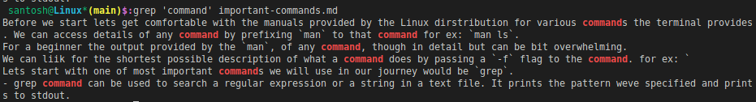

# Frequently used Linux Commands

Before we start lets get comfortable with the manuals provided by the Linux dirstribution for various commands the terminal provides. We can access details of any command by prefixing `man` to that command for ex: `man ls`.
For a beginner the output provided by the `man`, of any command, though in detail but can be bit overwhelming.
We can liik for the shortest possible description of what a command does by passing a `-f` flag to the command. for ex: 
```bash
santosh@~*$:man -f ls
ls (1)               - list directory contents
``` 
Similarly, we can pass for a help flag to know more options of any commands `ls --help`. This give us all arguments available for a perticular command. I am sure, This is one flag we will be using quite often.

Lets start with one of most important commands we will use in our journey would be `grep`.
## Grep
- grep command can be used to search a regular expression or a string in a text file. It prints the pattern weve specified and prints to stdout.



As we can see it outputs all the matches of the keyword **command** in the file **important-commands.md**. We can also pass a `-w` flag to search for the line containing the exact matching word.

## Tail
`tail`command as the name implies, the tail command is used to display the last values of the content of the file. By default, the last 10 lines are selected.
```bash
 santosh@Linux*(main)$:tail -n 5 important-commands.md
As we can see it outputs all the matches of the keyword **command** in the file **important-commands.md**. We can also pass a `-w` flag to search for the line containing the exact matching word.

## Tail
`tail`command as the name implies, the tail command is used to display the last values of the content of the file. By default, the last 10 lines are selected.
```
As you can see we had passed and `-n` flag to output the last 5 lines, instead of the default last 10. This would be quite useful while viewing the logs of containers, pods and other processes.

## Head
`head` as the name suggests, also inverse of `tail`, outputs the first part of files, tis too has a default line lenth opf 10.
```bash
santosh@Linux*(main)$:head -n 5 important-commands.md
# Frequently used Linux Commands

Before we start lets get comfortable with the manuals provided by the Linux dirstribution for various commands the terminal provides. We can access details of any command by prefixing `man` to that command for ex: `man ls`.
For a beginner the output provided by the `man`, of any command, though in detail but can be bit overwhelming.
We can liik for the shortest possible description of what a command does by passing a `-f` flag to the command. for ex:
```

# SED

`sed` is a stream text-editor that can perform editing operations in a non-interactive way. The sed command gets its input from standard input or a file to perform the editing operation on a file. It is a very powerful utility and you can do a lot of file manipulations using sed.

**Input file:**
```bash
santosh@~*$:cat test.txt 
# Frequently used Linux Commands

Before we start lets get comfortable with the manuals provided by the Linux dirstribution for various commands the terminal provides. We can access details of any command by prefixing `man` to that command for ex: `man ls`.
For a beginner the output provided by the `man`, of any command, though in detail but can be bit overwhelming.
We can liik for the shortest possible description of what a command does by passing a `-f` flag to the command. for ex:
```

For example if I run the command `sed 's/man/manual/' test.txt` This will replace all the words `man` with `manual` and output to stdout. Remember, This will not modify the input file. If we need to save the changes made by the `sed` command, we can save the contents of the stdout in a new file by *piping*  the output of the command to a new filw. Like so:
`sed 's/man/manual/' test.txt > test1.txt`

We can see the changes in the new file `test1.txt:
```bash
santosh@~*$:cat test1.txt 
# Frequently used Linux Commanualds

Before we start lets get comfortable with the manualuals provided by the Linux dirstribution for various commands the terminal provides. We can access details of any command by prefixing `man` to that command for ex: `man ls`.
For a beginner the output provided by the `manual`, of any command, though in detail but can be bit overwhelming.
We can liik for the shortest possible description of what a commanuald does by passing a `-f` flag to the command. for ex:
```

## Find

The `find` command in Linux walks through the file hierarchy. It can be used to find files and directories and perform subsequent operations on them. It supports searching by file, folder, name, creation date, modification date, owner and permissions.

The basic syntax is `find [path] [options] [expression]` where:
- [path]: It defines the directory where to begin searching.
- [options]: It defines the criteria of filtering e.g. searching a file/folder by its name, permission, time, or date.
- [expression]: It defines what actions to perform with the file. 

## ID
`id` command outputs the user and group information for each specified USER, or (when USER omitted) for the current user.
```bash
 santosh@Linux*(main)$:id devops  # User and Group details of user "devops"
uid=1001(devops) gid=1001(devops) groups=1001(devops)
 santosh@Linux*(main)$:id  # # User and Group details of current user
uid=1000(santosh) gid=1000(santosh) groups=1000(santosh),4(adm),24(cdrom),27(sudo),30(dip),<snip>
```
## Chown
In Linux there are different users who use the system. Different users in the operating system have ownership and permission to ensure that the files are secure and put restrictions on who can modify the contents of the files. The chown command changes user ownership of a file, directory, or link in Linux. 
Linux has three trpes of permissions to rotect and secure files and directory:
- **READ**: Allows the user to read files and in directories, it lets the user read directories and subdirectories stores in it.
- **WRITE**: Allows a user to modify and delete a file. Also, it allows a user to modify its contents (create, delete and rename files in it) 
- **EXECUTE**: Provides *Execute* permissions. If a binary or a `shell script` has a write [permissions only without Execute pwemission, the file will not be executed.

*Example: To change owner of the file*:

`chown <owner_name> <file_name>`

## Chmod

`chmod` command is used to change the access permissions of files and directories.
`chmod <permissions of user,group,others> {filename}`
Example:
To check the permissions available on a file or a directory:

In numerical representation, we have these options:

- “0” represents “no permission”.
- “1” represents “execute permission”.
- “2” represents “write permission”.
- “4” represents “read permission”.

# LSOF

`lsof` outputs the list of Open Files

`lsof -u <username>`

# AWK

`awk` awk is a scripting language which is an abbriviation for its authors Aho, Weinberger, Kernighan. When using awk, you are able to select data – one or more pieces of individual text – based on a pattern you provide. Its a powerful command to chose for a specific of data from a text file which is a table pattern. You can read more about the [comand here](https://www.freecodecamp.org/news/the-linux-awk-command-linux-and-unix-usage-syntax-examples/).

Basic syntax
`awk '{action}' your_file_name.txt`

The result is in a tabular form with rich information about the processes running.
- PID – the unique process ID
- TTY – terminal type that the user is logged into 
- TIME – amount of CPU in minutes and seconds that the process has been running 
- CMD – name of the command that launched the process. 
- TIME — Time consumed by the accumulated CPU utilization

# PS
 Linux peovides cababilites for multi-user to work and allows multiple processes simultaneously on a same machine, but in an isolated enviornment. `ps` short for *Process Status*, command provides the ability to inspect the processes running in the system. 

 Basic syntax:
 `ps <OPTION>`


## Uniq

`usniq` command takes an input as a Sorted-file and or an input from Standard input and removes any duplicates and prints the result to stdout. It is often used in conjunction with `sort` command to clean the output of duplicates.

> Note: Even `sort` supports a `-u` option, which removes duplicates from the sorted output.

Basic syntax for `uniq` `uniq foo.txt` the same result can be obtained with `sort` command with `sort -u foo.txt`, where `foo.txt` is a file containing sorted entries.
## Ifcongif

The `ifconfig` — *Interface Config* command is used for displaying current network configuration information, setting up an ip address, netmask, or broadcast address to a network interface, creating an alias for the network interface, setting up hardware address, and enable or disable network interfaces. This command can be used to activate or deactivate a specified Network Interface. This can be achived by using `up` or `down` down.
`ifconfig eno1 up` To activate interface `eno1`

`ifconfig eno1 down` To deactivate interface `eno1

This command gives many [cababilities for working with Network Interfaces](https://www.tecmint.com/ifconfig-command-examples/)

## NSLookup

`nslookup` (stands for “Name Server Lookup”) is a useful command for getting information from DNS server.
```bash
santosh@~*$:nslookup google.com
Server:         127.0.0.53
Address:        127.0.0.53#53

Non-authoritative answer:
Name:   google.com
Address: 172.217.31.206
Name:   google.com
Address: 2404:6800:4007:809::200e
```

## Curl

`curl` (short for "Client URL") is a command-line tool to transfer data to or from a server, using any of the supported protocols (HTTP, FTP, IMAP, POP3, SCP, SFTP, SMTP, TFTP, TELNET, LDAP or FILE). `curl` is powered by libcurl, a portable client-side URL transfer library. You can use it directly on the command line or include it in a script. The most common use cases for curl are:

- Downloading files from the internet
- Endpoint testing
- Debugging
- Error logging
This is an very extensive command and you can checkout more about [curl here](https://phoenixnap.com/kb/curl-command#:~:text=apt%20install%20curl-,What%20Is%20the%20curl%20Command%3F,to%20be%20sent%20or%20received.) 
Basic syntax is `curl [options/URLs]`

## IPTables

The `iptables` is a command-line interface used to set up and maintain tables for the Netfilter firewall for IPv4, included in the Linux kernel. The firewall matches packets with rules defined in these tables and then takes the specified action on a possible match.

- Tables is the name for a set of chains.
- Chain is a collection of rules.
- Rule is a condition used to match packet.
- Target is action taken when a possible rule matches. Examples of the target are ACCEPT, DROP, QUEUE.
- Policy is the default action taken in case of no match with the inbuilt chains and can be ACCEPT or DROP.

Basic syntax is `iptables --table TABLE -A/-C/-D... CHAIN rule --jump Target`


# Resources:
- [Linux commands in DevOps](https://www.edureka.co/blog/linux-commands-in-devops/#linuxcommands)