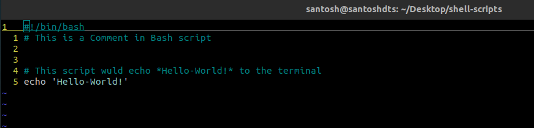

# Introduction to Bash Scripting

In DevOps, it's necessary to automate our everyday remedial tasks and Bash Scripts gives us the ability to do this. We can define a Bash script as simply a shell script which is no more than a series of commands that are stored in a file like a list. The shell reads this file and carries out the commands as though they have
been entered directly on the command line. One can write a Bash script on any Linux or macOS system, even on Windows, it is possible to write a Bash script by leveraging WSL (Windows Sbu-system for Linux). Bash scripts also known as Shell Script is a Programming Language in itself, and like any other language, Bash is a tool that can be used in several ways.

All bash scripts end with the extension `.sh`

## How to write a Shell Script


Every Bash script starts with `#! /bin/bash`. Here `#!` is a special construct known as *Shebang*. The shebang is used to tell the kernel the name of the interpreter that should be used to execute the script that follows in this case its `/bin/bash`.

In the below example. I have written a basic shell script named `hello-world.sh` which echoes `Helo-World!` to the terminal:

.

To run this script, we must give the executable permissions to the file we've created. To do that we can pass the following in the terminal to give executable permission to the file:
`chmod +x ./hello-world.sh`
Now, if we enter `./hello-world` on our terminal we would execute the script and be able to see *Hello World!* printed on the terminal.

As you can see, I've started with the first line with a *Shebang*. And you can also notice that the comments in a Bash script are written by prefixing a `#` at the start of the line and are ignored during execution.
To print the `Hello World!` to the terminal we use the `echo` command and give it an Input of "Hello World!". this works on the command line, too. pass `echo 'Hello World!'` in your terminal and you can see the same output as in our hello-world.sh script.

> **Good Locations for Scripts**: 
The `~/bin` directory is a good place to put scripts intended for personal use.

If we write a script that everyone on a system is allowed to use, the traditional location is `/usr/local/bin`. Scripts intended for use by the system administrator are often located in `/usr/local/sbin`. YOu can know more about [Linux Filsystem Hirerarchy here](./14-linux-filesystem.md).

## Variables and Constants

A variable, like in any other programming language, is nothing more than a pointer to the actual data. The shell enables you to create, assign, and delete variables. Unlike other programming languages, in which variables must be explicitly declared or defined before use. By convention, it's good practice to have uppercase letters to designate constants and lowercase letters for true variables. The word `variable` implies a value that changes, and the value of a constant does not change. However, The shell makes no distinction between variables and constants, mostly for the programmer’s convenience.

We shall add the variable `foo` and assign the value `Hello World!` to it in our previous example.


As you can see above, I've stored the string *Hello World!* in the variable `foo` and have also created another variable `bar` which stores some more string. If we execute this script, we can see both strings printed on separate lines. this is achieved by the `-e` flag passed on to the `echo` command which enables the interpretation of backslash escapes.  

**Local, Global Variables, and Shell Functions**
Global variables maintain their existence throughout the program. In contrast, Local Variables live inside a Shell Function in which they are defined and cease to exist once the shell function terminates. Having local variables allows the programmer to use variables with
names that may already exist, either in the script globally or in other shell functions, without worrying about potential name conflicts.

Below is an example of a Local variable used in a shell Function:


## Conditionals with If Statements

A Basic If conditional logic in a Shell script will be something like this:
```bash
if [<Condition Evaluating True>]; then
<Action if True>
else
<Action !True>
fi  # End of If Block
```

An example of an If conditional is to check if a number entered by a user is an Even or an Odd number. As you can see, here we are also reading the input provided by the user by the `read n` command in the script.


The output of the above script would be similar to:
```bash
---- EVEN OR ODD IN SHELL SCRIPT -----
Enter a number:40
RESULT: 40 is even
 santosh@shell-scripts*$:
```

We shall continue this journey of learning Shell Script together tomorrow with more Flow Control like Loops with While and Untill. 

# Resources
- [THE IMPORTANCE OF SHELL SCRIPTING IN DEVOPS](https://medium.com/@sophieshittu61/the-importance-of-shell-scripting-in-devops-563bcacc4118)