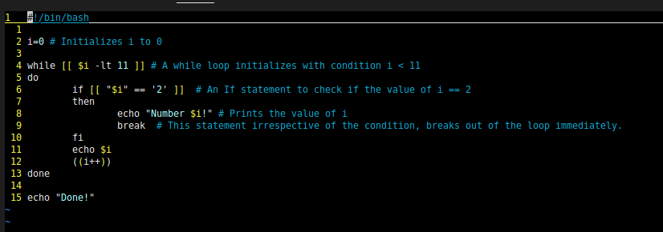
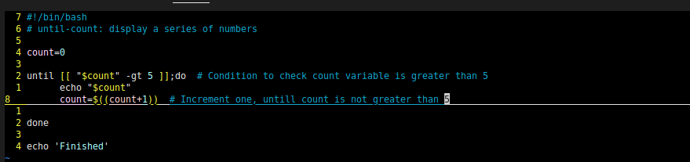

# Flow Control in Shell Scripting

In the [last article](./15-bash-scripting.md), we worked with some of the basics of the features provided by Bash scripting. Today we are going to work with various Control flow logic in programming, a concept called looping. We will explore `until` and `while` loops in Shell scripting.

## While Loop

The basic block of syntax for a `while` loop looks like this:
```bash
while [ condition ]  # This loop with start with the condition evaluating to true
do
   command1
   command2
   command3
done
```

Here we write a script to echo `Welcome to #90DaysOfDevOps` prefixed with an incrementing Sl.No.

```bash
#!/bin/bash
x=1  # Initializing variable x with 1
while [ $x -le 5 ]  # Condition, checks if x is less than 5 by `-le` operator
do  # Action to be performed if Condition is TRUE
  echo "Welcome $x times"
  x=$(( $x + 1 ))  # Increment the value of x after every iteration.
done  # End of Loop
```
This is very similar to the loops we've been programming in other languages. we have to make the note of various operators utilized n loops:

**Operator**-----------------------**Description**------------------------------------------**Example**

- `-ne`	    Checks if both operands are not equal	                                    `[ 1 -ne 2 ] is TRUE`
- `–eq`	    Checks if both the operands are equal	                                    `[ 1 -eq 2 ] is FALSE`
- `–lt`	    Check if the left operand is lesser than the right operand	                `[1-lt 2 ] is TRUE`
- `–gt`	    Check if the left operand is greater than the right operand	                `[1-gt 2 ] is FALSE`
- `–le`	    Check if the left operand is less than or equal to the right.	            `[1-le 2 ] is TRUE`
- `–ge`	    Check if the left operand is greater than or equal to the right.	        `[1-ge 2 ] is FALSE`

## Breaking out of the Loop

Bash provides mainly two commands for breaking out from loops and controlling the flow. The `break` command, immediately terminates the loop and the execution with the very next statement after the loop. The `continue` command, causes the remainder of the loop to be skipped, and program control resumes with the next iteration of the loop.    




Here is a `while` loop which continues with the loop after checking for condition ` if [[ "$i" == '2' ]]; then` statement.


## Until Loops

The `until` loop works similarly to a `while` loop. But, in contrast instead of breaking out of the loop with a non-zero exit code. The `until` loop continues until a zero exit status is received. It helps in a situation where you need to execute a set of commands while some condition is true. 

