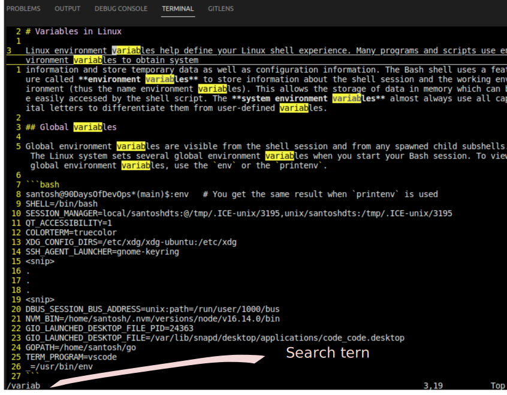

# Working with Vim

During our day-to-day work we would be working with lots of configuration files for writing Dockerfiles, Terraform, Kubernetes manifests, and other various files. To navigate through this process we would need a Text editor. Of course VS Code is the one recommended for coding and writing config files. However, we would also be dealing a lot with **command line-based text editor**, that's where Vim comes into play. Vim’s interface itself is a programming language. Vim discourages the use of the mouse because it’s too slow; Vim even avoids using the arrow keys because it requires too much movement.

Whenever we enter the vim editor, we enter the **NORMAL** mode, which is basically a read-only mode. In Normal mode, we can search for any string or number by pressing `/` which would enable the `search` mode, visible in the bottom-left of the terminal. 

**Normal mode**

In normal mode, you cannot insert any character. Normal mode is also known as [command mode](#command-mode) because all the keystrokes you perform are interpreted as commands.

- `h` move one character left
- `j` move one row down
- `k` move one row up
- `l` move one character right

We can customize our vim for mode productive workflow. as a start we would start with adding line numbers to our editor. for this we can open vim and add the following lines:

Though the above settings are minimal and Vim is a very extensible tool. We can modify the behavior of our editor to suit our needs.

As you can see in the above example, I tried to search for the term `variab` in a document. The process is to press `/` in Normal mode and type the search string. we can navigate through all the search results by pressing the `n` or `*` keys to jump to the next instance of the search string and `#` for hopping back to the previous instance.

## Insert mode

Insert mode in Vim is the one in which all the editing of the files will be carried out. to enter Insert mode from normal mode we simply press `i`. When we are in Insert of for that matter any mode, we will the information of our current mode in the Bottom left pane of our vim editor.

Similarly, we can enter into append mode by pressing `a` which also brings the editor in edit mode or by pressing `o` which enables us to insert a new line below the current line we've selected and enters insert mode on the new line.

Every command has an uppercase variety too, for example, the above commands `i`, `a`, and `o` if used with uppercase letters :

- `I`: Moves the cursor to the beginning of the line and enters insert mode
- `A`: Moves the cursor to the end of the line and enters insert mode
- `O`: Inserts a new line above the current one and enters insert mode on the new line

To Go back to Normal mode from any of the modes we press `Esc` or `ctrl C`.

## Visual mode

Vim provides a Visual mode, visual mode can be extremely useful for identifying chunks of text to be manipulated.

- Character mode: `v` (lowercase): Character mode can highlight a sentence in a paragraph or a phrase in a sentence. Then the visually identified text can be deleted, copied, changed, or modified with any other Vim editing command.
- Line mode: `V` (upper-case): Inters the Visual mode by selecting the whole line.
- Block mode: `Ctrl+v`: The visual block mode is useful for the manipulation of specific tabular data files, but it can also be extremely helpful as a tool to verify indentation.

After making the selection for manipulating the text, we can use `y` known as *Yanking* to cope the text or `p` for pasting the yanked text. or Indent a block of code by entering into Visual-Block mode and indenting it using the arrow keys.

## Command mode

Command mode has a wide variety of commands and can do things that normal mode can’t do as easily. To enter command mode type `:` (Colon) from normal mode and then type your command which should appear at the bottom of the window. For example, to do a global find and replace type `:%s/foo/bar/g` to replace all `foo` with `bar`. Here `s` stands for `substitute` in all lines `%` the string `/foo` that we want to replace with `/bar/` globally `g`.

> To go back to Normal mode from **any other mode** we press `Esc` or `ctrl C`.

# Resources:
- [Vim Cheat Sheet](https://vim.rtorr.com/)
- [The Missing Semester of Your CS Education — VIM](https://missing.csail.mit.edu/2020/editors/)
- [Vim Editor Modes Explained — FreeCodeCamp](https://www.freecodecamp.org/news/vim-editor-modes-explained/)
- [Popular Vim Commands](https://www.keycdn.com/blog/vim-commands)
- [Vim reference Guide](https://learnbyexample.github.io/vim_reference/Normal-mode.html)