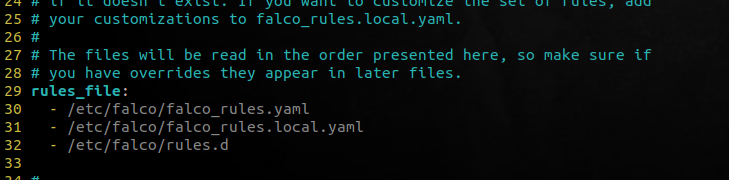
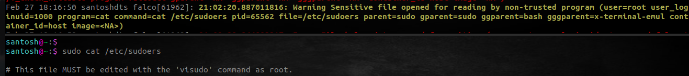
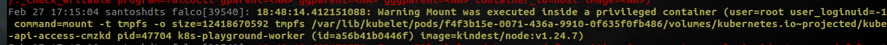
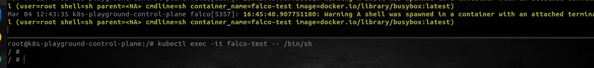

# Enhancing Security with Sysdig Falco: My Hands-On Experience

Containerization and microservices have revolutionized the way applications are developed and deployed. But, with these technological advancements come new challenges in securing the containerized environment. Security in a containerized environment requires a different approach than traditional security mechanisms. It involves the continuous monitoring of container activities, identifying security threats, and ensuring compliance.

In this blog, I share my hands-on experience with Sysdig Falco, an open-source tool designed specifically for securing containerized environments. It can be easily categorized as the de facto threat detection engine for Kubernetes and for cloud infrastructure. Because of its advanced features and capabilities, Sysdig Falco has become a popular choice among DevOps and security professionals alike.

I will discuss how Sysdig Falco enhances security in containerized environments and how it has helped me address security challenges. I will also share my experience with the tool and provide insights into its features and capabilities.

As we are aware Linux systems come with isolated environments — userspace and kernel space. Falco operates at both the user space and kernel space. The system calls are intercepted by the kernel module, an executable code deployed inside the OS kernel or [eBPF](https://ebpf.io) probes, which allows running scripts that safely perform actions inside the OS. The syscalls are then analyzed using the libraries in the userspace. Alerts are generated when there is a match in a rule defined in the rule engine and alerted to outputs that are configured as Syslog, files, Standard Output, and others. 

Falco can be installed on any local machine, cloud, managed Kubernetes cluster, or Kubernetes cluster. It mainly uses different drivers for collecting system calls' activity on the system. In this post, I will be installing Faco as a Package on my system so that it can detect any malicious activity occurring in the runtime. The detailed installation instruction for installing Faclo can be found here in the [official docs](https://falco.org/docs/getting-started/installation/#installation-details). I have gone ahead and installed the Falco package using the dialog and choosing the `falco-modern-bpf` driver for this demo.

Once the installation is complete, we can verify that the Falco package is installed correctly and running by using the `systemctl status falco-modern-bpf-service` command:

```shell
santosh@~:$ systemctl status falco-modern-bpf.service 
● falco-modern-bpf.service - Falco: Container Native Runtime Security with modern ebpf
     Loaded: loaded (/lib/systemd/system/falco-modern-bpf.service; enabled; vendor preset: enabled)
     Active: active (running) since Mon 2023-02-27 16:49:51 IST; 32s ago
       Docs: https://falco.org/docs/
   Main PID: 39540 (falco)
      Tasks: 9 (limit: 14115)
     Memory: 85.7M
        CPU: 1.787s
     CGroup: /system.slice/falco-modern-bpf.service
             └─39540 /usr/bin/falco --pidfile=/var/run/falco.pid --modern-bpf

Feb 27 16:49:51 santoshdts falco[39540]: Loading rules from file /etc/falco/falco_rules.yaml
Feb 27 16:49:51 santoshdts falco[39540]: Loading rules from file /etc/falco/falco_rules.local.yaml
Feb 27 16:49:51 santoshdts falco[39540]: The chosen syscall buffer dimension is: 8388608 bytes (8 MBs)
Feb 27 16:49:51 santoshdts falco[39540]: Starting health webserver with threadiness 4, listening on port 8765
Feb 27 16:49:51 santoshdts falco[39540]: Enabled event sources: syscall
Feb 27 16:49:51 santoshdts falco[39540]: Opening capture with modern BPF probe.
Feb 27 16:49:51 santoshdts falco[39540]: One ring buffer every '2' CPUs.
Feb 27 16:50:02 santoshdts falco[39540]: 18:23:12.408382864: Error File below /etc opened for writing (user=root user_loginuid=-1 command=falcoc>
Feb 27 16:50:15 santoshdts falco[39540]: 18:23:25.539821933: Error File below / or /root opened for writing (user=root user_loginuid=1000 comman>
Feb 27 16:50:18 santoshdts falco[39540]: 18:23:28.101536918: Error File below /etc opened for writing (user=root user_loginuid=-1 command=falcoc>
```

As you can see from the above output the Falco service is up and running and is already collecting logs.

## Falco Rules

Also, you can see from the above system status, Falco by default loads rules from the default directory `/etc/falco/falco_rules.yaml`. The default Falco configuration file is also placed in the same directory as `/etc/falco/falco.yaml`. At the very top of the Falco config file the order in which the rules will be evaluated is defined:



It is advisable and recommended practice, not to overwrite the main rules file, i.e `etc/falco/falco_rules.yaml file`, and make any modifications to the rules in the file located in the same directory by the name `/etc/falco/falco_rules.local.yaml`. We will see this in action later.

Falco ruleset basically is a `yaml` file consisting of five main components as a list.
    - **rule**:  a rule in any ruleset defines the name of the rule being defined.
    - **desc**: A short description of the rule.
    - **condition**: a [condition](https://falco.org/docs/rules/conditions/) is the important part in a rule. A condition is a boolean expression, which is evaluated when an event is triggered and detected by Falco. The condition stanza contains various [syscall event types](https://falco.org/docs/reference/rules/supported-events/), file descriptive combined with some [boolean operators](https://falco.org/docs/rules/conditions/#operators). You can also check all the supported fields on the command prompt by using `falco --list=syscall` command.
    - **output**: Output is the field that formats the logs in a readable format. The output is formatted in `<Timestamp> <Severity> <Message>`. The message can be broken down into two parts. The first is a human-readable message. The second includes some placeholders (ex: `%user,name`), that will be populated when outputted. The placeholders, start with a `%` symbol followed by one of the event's supported fields as in the `condition` field.
    - **Priority**:  This firld indicates the [severity](https://falco.org/docs/rules/basic-elements/#priority) of the rule being voilated. This is included in the output logs. Priority field can include values like **EMERGENCY, ALERT, CRITICAL, ERROR, WARNING, NOTICE, INFORMATIONAL, DEBUG**.  

The above structure forms a rule in Falco. But, the rules can include some more fields like, `list`, `macro`, `exceptions`, `tags`, etc, to form advanced rules. You can read more on this in [official docs](https://falco.org/docs/rules/basic-elements/#advanced-rule-syntax).

## Working with Falco Hands-on 

So now, we have some understanding of the Falco rules and Falco configured, up and running. Let's put it to work.

To witness Faclo in action, let's try to open a sensitive file on any Linux system `/etc/sudoers` file which needs sudo access. Simultaneously, I will open another terminal to view systemd logs with the `journalctl -fu falco-modern-bpf` command:



The Falco outputs the logs whenever a **condition** in a rule matches an event being triggered. You can see, the Falco tool detected that a sensitive file `/etc/shadow` was opened for reading. with a priority of **Warning**. The output also provides some context to the event, like the `user` who tried to open the file, it was `root` in our case, the name of the file, etc.   

Now, let us test it with Kubernetes:

First, in order to enable communication between our security tool Falco and Containers/CRI and [fetch information from the containers](https://falco.org/docs/getting-started/deployment/#docker-deprecation-in-kubernetes). We need to install falco as a Daemonset on our Kubernetes cluster. This enables, falco to query the CRI — containerd for events. 

```bash
santosh@blogs:main$ k get po -n falco
NAME          READY   STATUS    RESTARTS      AGE
falco-gxxb6   2/2     Running   7 (34m ago)   3d15h
falco-rpz45   2/2     Running   7 (34m ago)   3d15h
```
Once, the Falco pods are up and running on both the nodes (I've installed it on my two-node Kind cluster. hence, two pods). We can move ahead and see Falco watching the processes triggered by Containers as well.

To see this in action, I've deployed a pod named `privileged1`, which is just a busybox container running with some serious security flaws in the configurations:

```yaml
apiVersion: v1
kind: Pod
metadata:
 creationTimestamp: null
 labels:
 run: privileged1
 name: privileged1
spec:
 containers:
  - args:
    - sleep
    - 1d
 image: nginx
 name: privilaged
 securityContext:
 privileged: true
 runAsUser: 1000
 allowPrivilegeEscalation: true
<snip>
```
> In order to view the logs, we need to exec into the Kind node, install Falco and view the logs 

Now, let's deploy this pod and see if Falco catches the security misconfiguration in the workload.



As expected, Falco detected that a privileged prod was created and a volumeMount was executed inside the container. The severity of the output is set to Warning in this case. Suppose, we now try to spawn a shell inside the container. As spawning a shell inside a container is considered a security risk, Falco would again sense this and alert us about this.

  

## Modifying a rule

Another point to notice from the above image is that the output in the logs is more concise giving only the relevant information about the user and container. This is achieved by altering the default rules to provide the output. As we discussed earlier in the [Rules section](#falco-rules), the rules are evaluated based on their listing in the main Falco config file. The default rules `faclo_rules.yaml` file is one which comes pre-installed with all the rules designed by the wonderful Falco community and may get changed during upgrades. Keeping this in mind, all the modification to the rules is made in a local rules file listed below the `falco_rules.yaml` file namely, `falco_rules.local.yaml`. Hence, while evaluating the rules, Falco looks first goes through the main rules file and then to the local file to evaluate the rules.

In order to make any changes to the existing rules, we need to add our custom rules in the `falco_rules.local.yaml` file. 

```shell
santosh@blogs:main$ cat /etc/falco/falco_rules.local.yaml 
# Custom rules!


 - rule: Terminal shell in container
    desc: Detects a shell being spawned in a Container
    condition: container.id != host and proc.name in (linux_shells)
    output: >
      A shell was spawned in a container with an attached terminal (user=%user.name user_name=%user.loginname shell=%proc.name parent=%proc.pname cmdline=%proc.cmdline container_name=%container.name image=%container.image)
    priority: WARNING
 
  - list: linux_shells
    items: [sh, bash, zsh]
```

There are various events that falco tracks for evaluating the process and generating readable output. We can learn more about all the [event types](https://falco.org/docs/rules/supported-events) and [supported fields](https://falco.org/docs/rules/supported-fields) in the rules **Condition** field from Falco's official docs.

> Once, the `falco_rules.local.yaml` file is altered, we need to restart the Falco service either by `systemctl restart falco-modern-bpf.service` or by hot reloading, this method does not restart the systemd service and restart the falco instance by identifying the pid of falco and sending a `sughup` signal by using this command: `kill 1 $(cat pidof falco)`.

## Conclusion

In this post, we've just scratched the surface of the runtime security paradigm by working with Falco. Falco also supports [**Kubernetes Audit logs**](https://kubernetes.io/docs/tasks/debug/debug-cluster/audit/) by ingesting the Kubernetes events as [event source](https://falco.org/docs/event-sources/) among others. Falco's support for monitoring the  Kubernetes Audit logs in real-time provides an additional layer of security for Kubernetes environments and helps organizations detect and respond to security threats quickly and effectively. 

In the next post, we will be integrating Falco with Kubernetes, enabling robust runtime security for our Kubernetes cluster.
