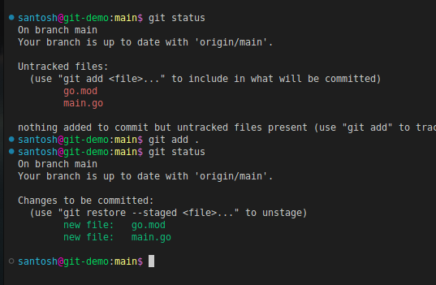

# Inroduction to Git 

Git is a Version Control System, build for keeping track of history and enable seamless collaboration between different teams working on a codebase. GIt is a modern software development paradigm, providing a robust and efficient way to manage changes to source code and other digital files. Whether you're working on a small personal project or a large-scale enterprise project, Git can help you collaborate, track changes, and maintain the stability of your codebase.

With Git, every time you commit, or save the state of your project, Git basically takes a picture of what all your files look like at that moment and stores a reference to that snapshot. Git thinks about its data more like a stream of snapshots.

# Installing Git

Installing Git on Ubuntu/Linux system is as simple as installing any other packages on a ubuntu system. We can install it from the `apt` package manager.

`apt-get install git-all`. Thjis command will install git package on the our system. For other Operating systems one can refer the [official installation guide](https://git-scm.com/download) for more info.

Once git is installed, we can verify by just passiing the command `git` on the terminal and we should be provided with all the options we can pass for different workflows with git, like so:

```bash
santosh@90DaysOfDevOps:main$ git
usage: git [--version] [--help] [-C <path>] [-c <name>=<value>]
           [--exec-path[=<path>]] [--html-path] [--man-path] [--info-path]
           [-p | --paginate | -P | --no-pager] [--no-replace-objects] [--bare]
           [--git-dir=<path>] [--work-tree=<path>] [--namespace=<name>]
           [--super-prefix=<path>] [--config-env=<name>=<envvar>]
           <command> [<args>]

These are common Git commands used in various situations:

start a working area (see also: git help tutorial)
   clone     Clone a repository into a new directory
   init      Create an empty Git repository or reinitialize an existing one
.
.
.
'git help -a' and 'git help -g' list available subcommands and some
concept guides. See 'git help <command>' or 'git help <concept>'
to read about a specific subcommand or concept.
See 'git help git' for an overview of the system.
```
As discussed earlier, git tracks the history of our projects. We can see this by logging the same using `git log` command.


One of the key advantages of using git in our workflows is, that we can maintain different versions of the same project, where each individual or a team works on the same codebase without iterfearing with others team's codebase. This feature is achived by a concept in git known as `Branch`. we can creata a separate branch from the main and make required changes without affecting the working of the code stored on main or other brances.


We can use git's checkout command to create and work in a specific branch:

```bash
santosh@90DaysOfDevOps:main$ git checkout -b demo
Switched to a new branch 'demo'
santosh@90DaysOfDevOps:demo$ 
```
Above, I've created and checked out into the **demo** branch. Now, I can work on any bug-fixes or improvements to the codebase in isolation. 

Once, I've completed the required work on the newly created branch. I can **Merge** it to the main branch. Merge is another key feature of Git, which enables seamless workfing on a single codebase by multiple members. Each one working in iso,ation in their respective branches and once then when relevant work is completed. They can merge their work in the Main codebase.


## Git Stageing

One of the core functions of Git is the concepts of the Staging Environment, and the Commit. While we are working, we may add or edit some files pertaining to our project. Once, that work is finished, we need to we need to add the changeds to the **Staging** area from where, we can commit — save the snaposhot of those changes in Git. We achieve this by using the `git add` command. Git add saves the filw we are working on to the staging area, from where we can proceed to commit the work in our git history.

`git status` shows all the files we are working on, which we can add to the staging area by using `git add <file name>` command:



Now, as I've added the files to the staging area. We can commit his work to save it in git. 


## Git Commit
 Now, as we've added our work to the staging area. We shouyld be ready to capture the snapshot of the staged changes made to the project. `git commit` is the command that achieves this for us. We can pass a comment while committing the changes so as we can find that perticular commit from logs. This helps when we start working ferquently on a project and make multiple commits to it. The syntax fro commiting the staged changes using git commit will be as folowing:

```bash
santosh@git-demo:main$ git commit -m "Initial commit with hello world in Go"
[main 20084a1] Initial commit with hello world in Go
 2 files changed, 10 insertions(+)
 create mode 100644 go.mod
 create mode 100644 main.go
```

Here notics the `-m` flag, its for passing a commit message. There are many flags for all the commands, we can use `--help` flag to know more about these. So we have commited the code we can see the logs by passing `git log` command:


You can see, I've made two commits and the latest commit shows the a marker as **HEAD**. HEAD is the reference to the most recent commit in the current branch. This means HEAD is just like a pointer that keeps track of the latest commit in your current branch.

Now, we've commited the changes and have stored the snapshot in time of the code locally in Git. Now, if another member of a team working on the same project from a different locationcan't access it and work on it with Git based workflow. Foir this we need to store all the code in a central location from where, every one can access the codebase and work on their respective tasks without interfering with others work. But, be able to merge the code to the main codebase when his/her's tasks is completed following a Git based workflow. This is made iseasy by hoisting platforms like **GitHub**, **BitBucket**, **GitLab**, etc.

In next session, we shall explore more abour such services peoviding a central location for storing our code in git based workflow and many rich features through a concept known as Git repository that helps developers store, manage, track and control changes to their work.


# Resources:
- [Getting Started - What is Git?](https://git-scm.com/book/en/v2/Getting-Started-What-is-Git%3F)
- [Git Tutorial for Beginners: Learn Git in 1 Hour](https://youtu.be/8JJ101D3knE)
- [Git and GitHub for Beginners - Crash Course](https://www.youtube.com/watch?v=RGOj5yH7evk&t=8s)
- [Complete Git and GitHub Tutorial by Kunal Kushwaha](https://youtu.be/apGV9Kg7ics)